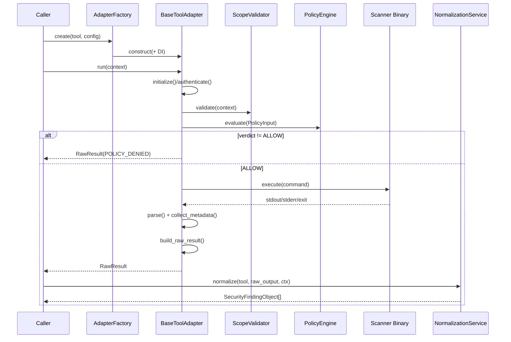
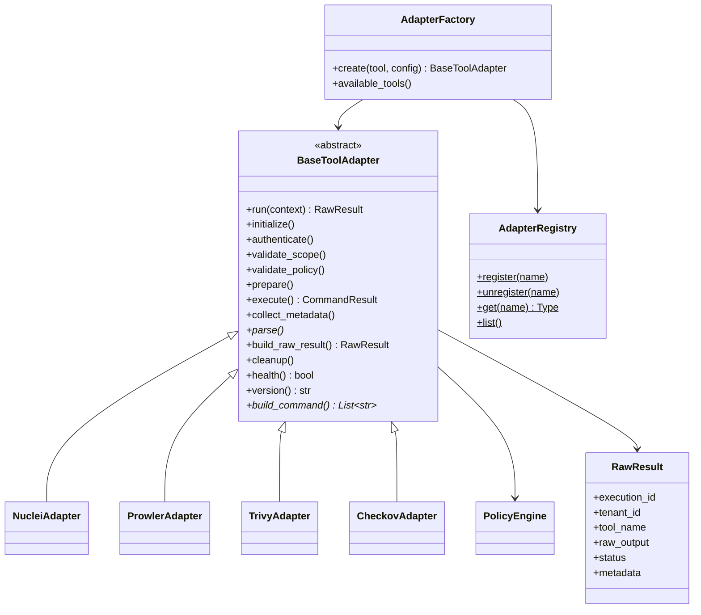

# Xolaris Security Tool Adapter Framework

## Architecture Explanation

The adapter framework is the **hexagonal port** between external security
scanners and the Xolaris platform core.

Adapters are responsible for:

1. Authentication
2. Scope validation
3. **Mandatory PolicyEngine evaluation** (never execute without ALLOW)
4. Tool execution (subprocess)
5. Metadata / metrics collection
6. Parsing vendor stdout into structured JSON
7. Returning a **`RawResult` only**

Adapters **must never** create `SecurityFindingObject`. That conversion is
owned exclusively by the Normalization Service:

```
Security Tool
    ↓
Tool Adapter  ──► RawResult
    ↓
Normalization Service
    ↓
SecurityFindingObject
```

Existing modules (Decision Engine, Context Manager, Prompt Builder, Provider
Factory, Canonical Models, Normalization Service, Policy Engine) are **not
modified**. The adapter layer **calls** PolicyEngine via dependency injection.

---

## Sequence Diagram



---

## Class Diagram



---

## Folder Structure

```
src/adapters/
├── base/
│   ├── base_adapter.py
│   ├── raw_result.py
│   ├── adapter_config.py
│   ├── adapter_exception.py
│   ├── registry.py
│   └── factory.py
├── common/
│   ├── authentication.py
│   ├── scope_validator.py
│   ├── metadata_collector.py
│   ├── execution_context.py
│   └── retry.py
├── nuclei|prowler|trivy|checkov/
│   ├── adapter.py
│   ├── parser.py
│   └── config.py
├── bootstrap.py
└── ARCHITECTURE.md
```

---

## Adding a Future Adapter

**Full team guide (checklist, MCP/agents, examples):** [docs/adapters/README.md](../../../docs/adapters/README.md)

Quick steps:

1. Create `src/adapters/<tool>/{config,parser,adapter}.py`
2. Subclass `BaseToolAdapter`
3. Decorate with `@AdapterRegistry.register("<tool>")`
4. Implement `build_command` + `parse`
5. Add matching **normalizer** in `normalization/adapters/`
6. Import the module from `bootstrap.py`
7. Optional: wire `scan_ingest` `_CONFIGS` + simulate sample payload

No business-logic changes required in Policy Engine core or downstream engines.

---

## Usage

```python
from src.adapters import AdapterFactory, AdapterRegistry
from src.adapters.nuclei import NucleiAdapterConfig
from src.adapters.common import AdapterExecutionContext

adapter = AdapterFactory().create("nuclei", NucleiAdapterConfig())
raw = adapter.run(context)          # RawResult
# later: NormalizationService().normalize("nuclei", raw.raw_output, norm_ctx)
```
