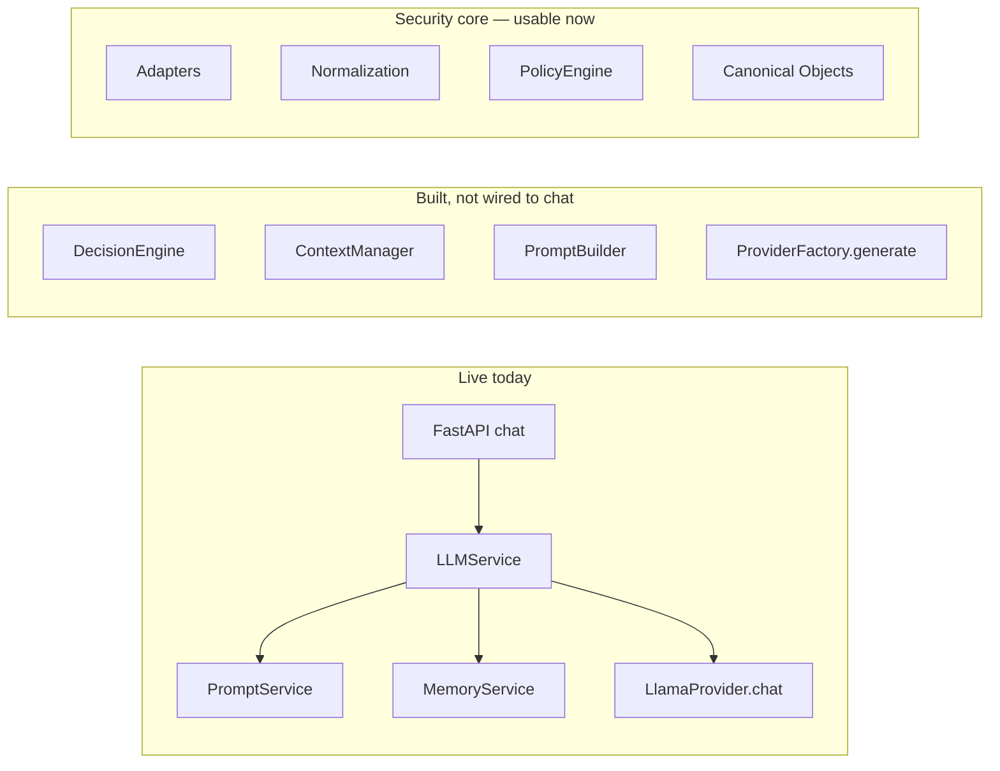
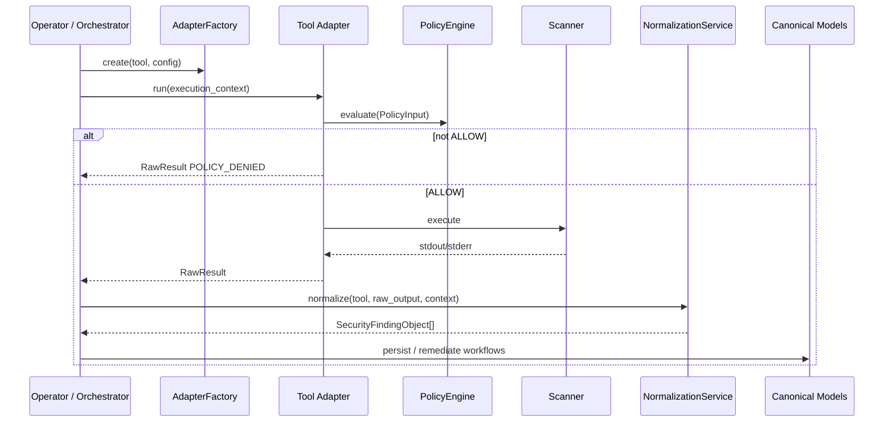

# 00 — Platform Overview

## Purpose

Xolaris is an **autonomous cybersecurity remediation platform**, not a chatbot.

It ingests scanner output, normalizes it into canonical security objects, governs every action with policy, and (via Architecture V2 scaffolds) will eventually route AI-assisted analysis through Decision → Context → Prompt → Provider layers.

## High-level layers

| Layer | Role |
|-------|------|
| **Ingest** | Tool adapters produce `RawResult`; normalization emits `SecurityFindingObject` |
| **Domain** | Canonical objects for findings, evidence, decisions, remediations, outcomes |
| **Governance** | Policy Engine gates READ → EXECUTE_* actions (fail closed) |
| **AI V2 (scaffold)** | Decision Engine, Context Manager, Prompt Builder, Provider Factory |
| **API (legacy live path)** | FastAPI → LLMService → PromptService / MemoryService → LlamaProvider |

## Current runtime vs scaffold

**Important:** Completing a scaffold module does not change the live `/chat` path until an explicit integration task wires it.

## End-to-end security ingest (implemented)

## Design principles

1. **Canonical models are the single source of truth** — never pass raw scanner JSON into remediation or AI prompts.
2. **Never execute without policy** — adapters and execution paths must call PolicyEngine first.
3. **Hexagonal adapters** — new scanners plug in via registry/factory without changing business logic.
4. **AI scaffolds stay decoupled** until integration is deliberate.
5. **Fail closed** — missing policy, malformed input, or unknown tools deny / reject.

## Repository layout (application root: `backend/`)

| Path | Module |
|------|--------|
| `decision_engine/` | Decision Engine |
| `context/` | Context Manager |
| `prompt/` | Prompt Builder |
| `providers/` | Provider Factory (+ V1 LlamaProvider) |
| `models/` | Canonical security objects (+ legacy API models) |
| `normalization/` | Normalization Service |
| `policy_engine/` | Policy Engine |
| `src/adapters/` | Security Tool Adapter Framework |
| `api/`, `services/`, `app.py` | Live FastAPI / LLMService path |

## What comes next (not documented as done)

- Wire Architecture V2 into `LLMService` behind feature flags
- Remediation execution engine consuming `RemediationObject`
- Persistence repositories for canonical objects
- OPA transport behind `OpaPolicyBackend`
- Additional adapters (Grype, OSV, Gitleaks, ZAP, …)
