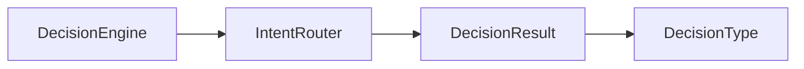
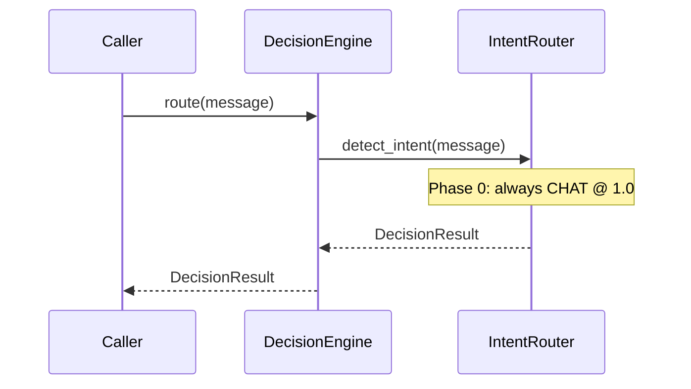

# 01 — Decision Engine

## Purpose

Classify an inbound user/message intent into a routing decision for Architecture V2 (`CHAT`, `TOOL`, `RAG`, `MEMORY`, `AGENT`, `UNKNOWN`).

Today this is a **passthrough scaffold**: every message becomes `CHAT` with confidence `1.0`.

## Responsibilities

| Owns | Does not own |
|------|----------------|
| Intent routing contract | Prompt assembly |
| `DecisionResult` model | Context retrieval |
| Extensible `IntentRouter` | LLM calls / providers |

## Inputs

| Name | Type | Notes |
|------|------|-------|
| `message` | `str` | Raw user text |

## Outputs

| Name | Type | Notes |
|------|------|-------|
| `DecisionResult` | Pydantic model | `decision_type`, `confidence`, `reason`, `metadata` |

## Dependencies

- **Upstream (future):** `LLMService`
- **Downstream (future):** `ContextManager`
- **Forbidden today:** Must not be imported by live chat path until integration task

## Key types

- `DecisionType` — CHAT | TOOL | RAG | MEMORY | AGENT | UNKNOWN
- `DecisionResult` — routing outcome
- `IntentRouter.detect_intent(message)`
- `DecisionEngine.route(message)`

## Sequence diagram

## Extension points

- Inject a custom `IntentRouter` (classifier, rules, or LLM-backed) via constructor DI
- Keep `route(message) -> DecisionResult` stable for callers

## Non-goals

- No NLP / LLM classification yet
- No FastAPI exposure
- No side effects (memory, tools, RAG)

## Source paths

- `backend/decision_engine/`
- Package README: `backend/decision_engine/README.md`
