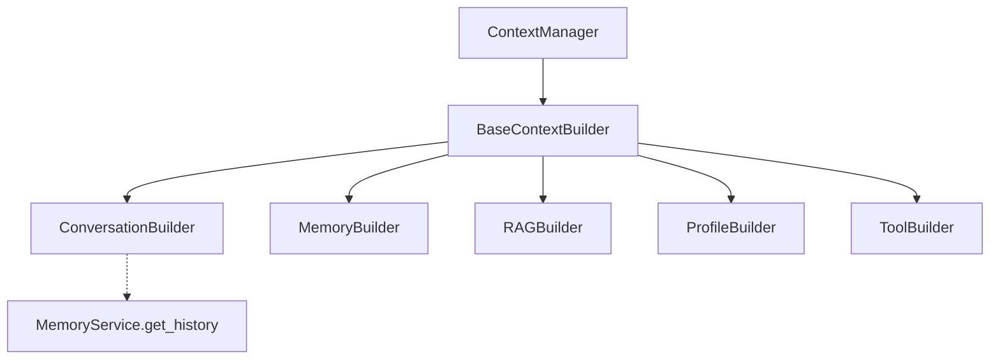
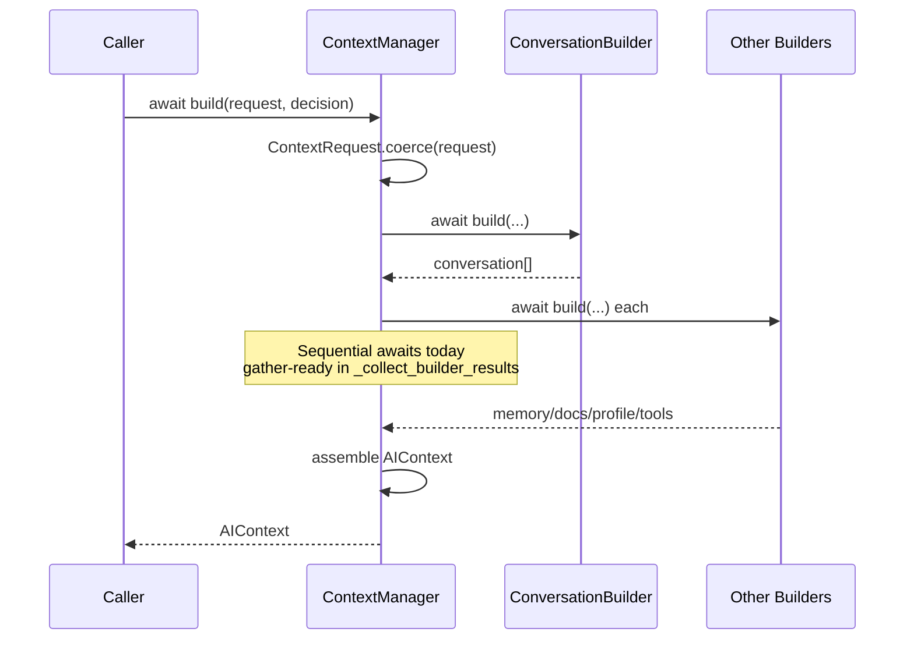

# 02 — Context Manager

## Purpose

Assemble everything an LLM call needs for one request into a single `AIContext` (conversation, memory, documents, profile, tools, decision metadata).

## Responsibilities

| Owns | Does not own |
|------|----------------|
| Orchestrating builders | Prompt formatting |
| `AIContext` schema | Provider selection |
| Builder pipeline registration | Persisting long-term memory stores |

## Inputs

| Name | Type | Notes |
|------|------|-------|
| `request` | `ContextRequest` / coerceable | `message`, `session_id` |
| `decision` | `DecisionResult` | From Decision Engine |

## Outputs

| Name | Type | Notes |
|------|------|-------|
| `AIContext` | Pydantic model | `version="1.0"` + nested slices |

## Dependencies

- **Upstream (future):** Decision Engine
- **Downstream (future):** Prompt Builder
- **External (ConversationBuilder only):** may use `MemoryService.get_history` when injected; default instance is **not** shared with live `LLMService` until integration

## Key types

- `AIContext`, `ContextRequest`, `ConversationMessage`, `MemoryContext`, `DocumentChunk`, `ProfileContext`, `ToolResult`
- `BaseContextBuilder` — `field_name` + `async def build(...)`
- `ContextManager.build` — async orchestrator

## Sequence diagram

## Extension points

- Append builders (e.g. `ThreatIntelBuilder`) to the pipeline; unknown `field_name` → `metadata.extensions`
- Swap to `asyncio.gather` inside `_collect_builder_results` with minimal change

## Non-goals

- No Redis / Qdrant / MCP implementations yet
- No wiring into `LLMService`
- ContextManager contains **no domain retrieval business logic** beyond orchestration

## Source paths

- `backend/context/`
- Package README: `backend/context/README.md`
