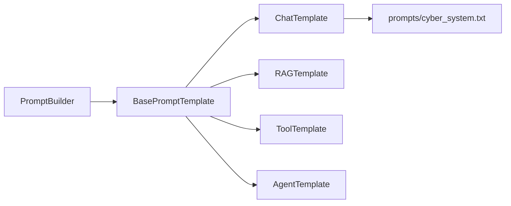
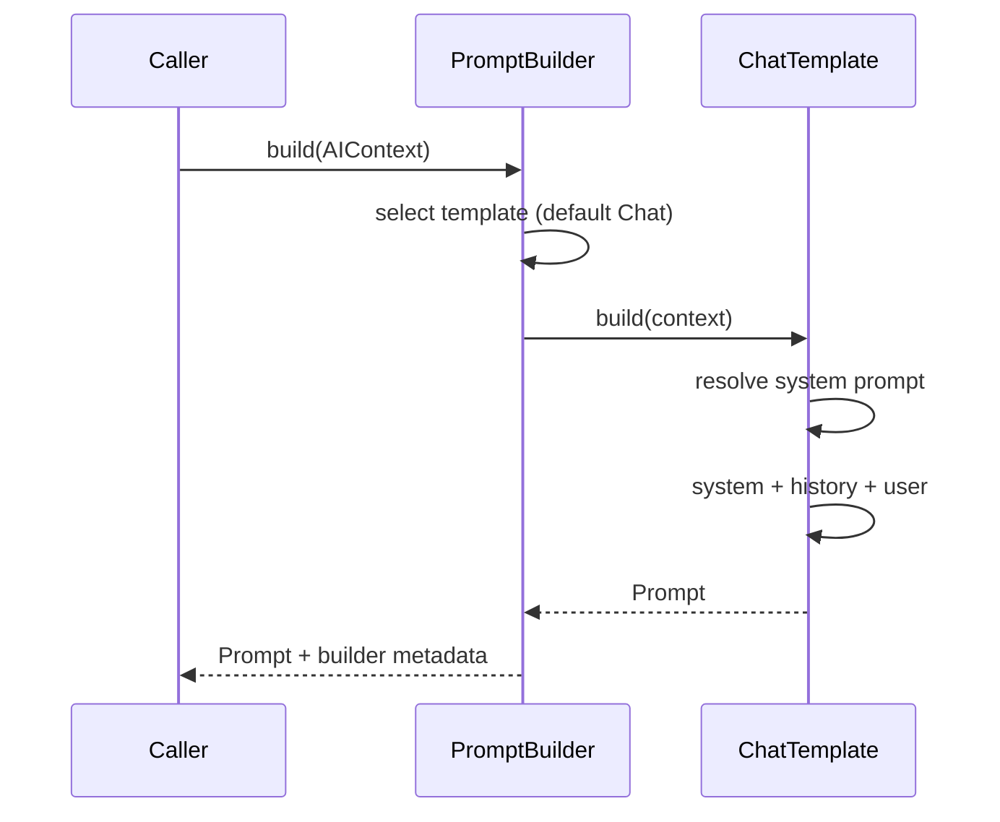

# 03 — Prompt Builder

## Purpose

Turn an `AIContext` into a provider-ready `Prompt` (system text, ordered messages, metadata, provider hints).

## Responsibilities

| Owns | Does not own |
|------|----------------|
| Template selection / formatting | Context retrieval |
| `Prompt` model | Calling LLM providers |
| Chat / RAG / Tool / Agent templates | Mutating `PromptService` (legacy) |

## Inputs

| Name | Type | Notes |
|------|------|-------|
| `context` | `AIContext` | From Context Manager |

## Outputs

| Name | Type | Notes |
|------|------|-------|
| `Prompt` | Pydantic model | `system_prompt`, `messages`, `metadata`, `provider_hints` |

## Dependencies

- **Upstream (future):** Context Manager
- **Downstream (future):** Provider Factory
- **Legacy:** Reads the same `cyber_system.txt` file as `PromptService` but **does not modify or call** `PromptService`

## Key types

- `Prompt`, `PromptMessage`, `ProviderHints`
- `BasePromptTemplate.build(context) -> Prompt`
- `PromptBuilder.build(context) -> Prompt` (phase 0 always uses `ChatTemplate`)

## Sequence diagram

## Extension points

- Inject `default_template` or decision→template map
- Implement real RAG/Tool/Agent formatting when those paths activate

## Non-goals

- No live integration with `LLMService`
- Placeholders for RAG/Tool/Agent are explicit, not silent no-ops in production paths yet

## Source paths

- `backend/prompt/`
- Package README: `backend/prompt/README.md`
