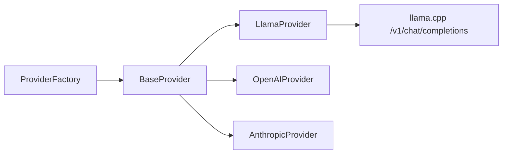
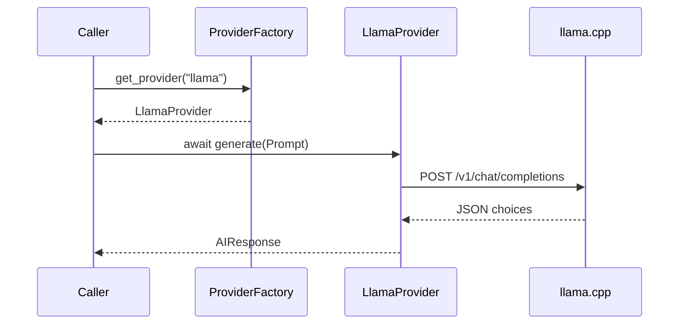

# 04 — Provider Factory

## Purpose

Resolve a provider name to a `BaseProvider` and expose a uniform V2 contract:

`async generate(prompt: Prompt) -> AIResponse`

## Responsibilities

| Owns | Does not own |
|------|----------------|
| Provider registry / lookup | Prompt building |
| Normalized `AIResponse` | Chat API contracts |
| Provider exception taxonomy | Decision / context assembly |

## Inputs

| Name | Type | Notes |
|------|------|-------|
| `provider_name` | `str` | e.g. `llama`, `openai`, `anthropic` |
| `prompt` | `Prompt` | For `generate` |

## Outputs

| Name | Type | Notes |
|------|------|-------|
| `BaseProvider` | ABC instance | From factory |
| `AIResponse` | Pydantic model | From `generate` |

## Dependencies

- **V1 compatibility:** `LlamaProvider.chat` / `stream_chat` remain for live `LLMService` — unchanged contracts
- **V2:** `generate(Prompt)` on Llama is implemented; OpenAI/Anthropic raise `ProviderNotImplementedError`

## Key types

- `AIResponse` — text, provider, model, usage, finish_reason, metadata
- `ProviderFactory.get_provider(name)`
- Exceptions: `UnknownProviderError`, `ProviderNotImplementedError`, `ProviderRequestError`, …

## Sequence diagram (V2)

## Extension points

- `factory.register(name, provider)` or constructor `providers={...}`
- Implement OpenAI/Anthropic `generate` without changing factory callers

## Non-goals

- Not wired into `LLMService` V2 path yet
- No shared httpx lifespan pool yet

## Source paths

- `backend/providers/`
- Package README: `backend/providers/README.md`
