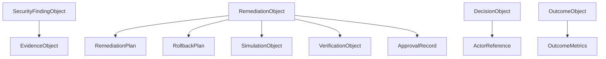
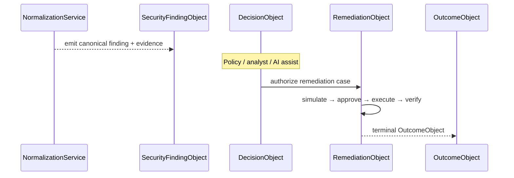

# 05 — Canonical Security Objects

## Purpose

Provide the **single source of truth** domain models for Xolaris security workflows.

Every adapter output (after normalization), policy decision about findings, remediation plan, verification, and outcome must use these types. Raw scanner payloads must never be treated as domain state.

## Responsibilities

| Owns | Does not own |
|------|----------------|
| Finding / evidence / decision / policy / remediation / simulation / verification / outcome schemas | Scanner execution |
| Domain enums & validators | Persistence repositories (future) |
| Fail-closed validation (`extra="forbid"`) | AI prompt formatting |

## Inputs

Constructed by services/adapters/workflows from trusted fields (UUIDs, enums, nested objects).

## Outputs

Validated Pydantic instances used across the platform.

## Core objects

| Object | Role |
|--------|------|
| `SecurityFindingObject` | Canonical risk record |
| `EvidenceObject` | Content-addressed proof (`raw_artifact_id` + hash + lineage) |
| `DecisionObject` | Remediation/governance decision (≠ AI `DecisionResult`) |
| `PolicyObject` | Versioned rule documents for remediation governance |
| `RemediationObject` | Plan + rollback + simulation + approval + verification |
| `SimulationObject` | Pre-exec blast-radius dry run |
| `VerificationObject` | Post-exec proof |
| `OutcomeObject` | Terminal workflow result |

## Dependencies

- **Consumers:** Normalization Service, Policy Engine (optional finding on input), future remediation engine
- **Distinct from:** `decision_engine.DecisionResult` (AI routing)

## Key validation rules (examples)

- Critical findings require ≥1 `EvidenceObject`
- CVSS must align with severity bands when both present
- EXECUTE success path requires passed simulation (destructive) and passed verification (in remediation model)
- Metadata maps are bounded — not raw scanner dumps

## Sequence diagram (domain lifecycle)

## Extension points

- Add enums carefully (closed vocabularies)
- New nested value objects under `models/` with the same `FortiBaseModel` base

## Non-goals

- Not an ORM layer
- Not an API DTO layer (legacy `request_models` / `api_response` remain separate)

## Source paths

- `backend/models/security_finding.py`, `evidence.py`, `decision.py`, `policy.py`, `remediation.py`, `simulation.py`, `verification.py`, `outcome.py`, `enums.py`, `common.py`
