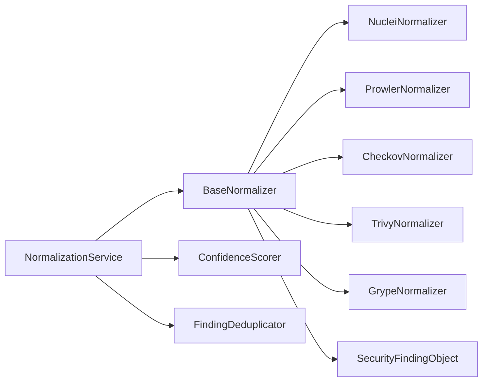
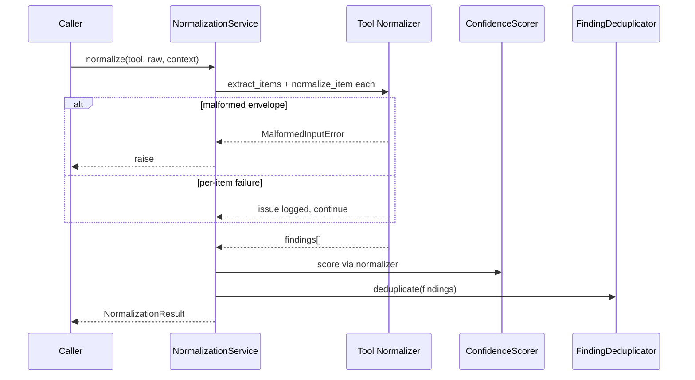

# 06 — Normalization Service

## Purpose

Convert **raw tool JSON** into canonical `SecurityFindingObject` instances via the Adapter Pattern (per-tool normalizers).

> Note: Tool **execution** adapters (`src/adapters`) produce `RawResult`.  
> This Normalization Service consumes `raw_output` / vendor JSON and emits findings.

## Responsibilities

| Owns | Does not own |
|------|----------------|
| Schema validation of vendor payloads | Running scanners |
| Mapping severity / taxonomy / CVEs | Creating findings inside tool adapters |
| Confidence scoring | Persistence |
| Batch deduplication | AI reasoning |

## Inputs

| Name | Type | Notes |
|------|------|-------|
| `tool` | `str` | `nuclei`, `prowler`, `checkov`, `trivy`, `grype` |
| `raw_payload` | JSON / JSONL | Vendor structure |
| `context` | `NormalizationContext` | `tenant_id`, `asset_id`, `raw_artifact_id`, … |

## Outputs

| Name | Type | Notes |
|------|------|-------|
| `NormalizationResult` | envelope | `findings: list[SecurityFindingObject]`, `issues`, `duplicates_removed` |

**Downstream must use `findings` only** — never re-parse vendor JSON for business logic.

## Dependencies

## Sequence diagram

## Extension points

- `NormalizationService.register(normalizer)`
- Subclass `BaseNormalizer` for a new tool; map into `SourceTool` enum

## Non-goals

- Does not call Policy Engine or AI modules
- Does not execute scanner binaries

## Source paths

- `backend/normalization/`
- Adapters: `backend/normalization/adapters/`
