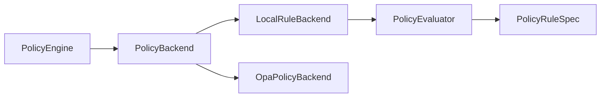
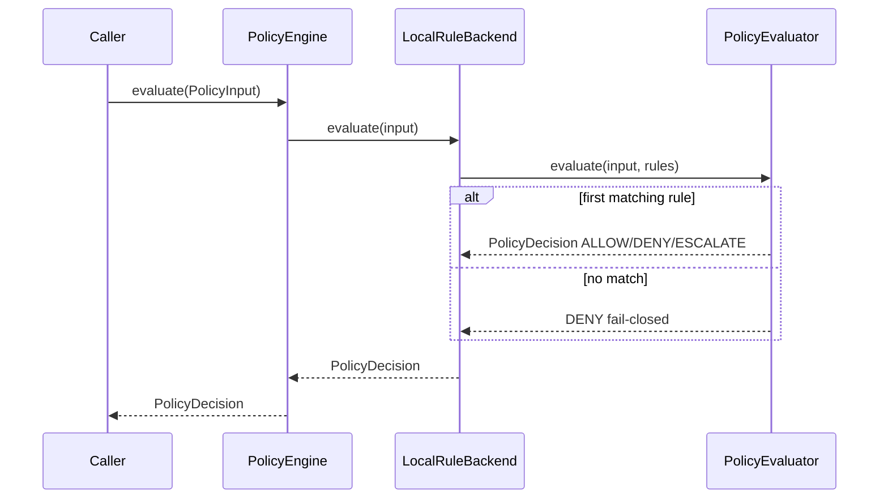

# 07 — Policy Engine

## Purpose

Authorize **every security action** before it proceeds. Fail closed: no matching rule ⇒ `DENY`. Execute actions must never be `ALLOW` without a matched policy rule.

## Responsibilities

| Owns | Does not own |
|------|----------------|
| `PolicyInput` / `PolicyDecision` contracts | Running scanners |
| Local rule evaluation | UI / approvals UX |
| Backend abstraction (local + OPA seam) | Emitting findings |

## Inputs (`PolicyInput`)

| Field | Type |
|-------|------|
| `tenant_id` | `UUID` |
| `user` | `ActorReference` |
| `scope` | `PolicyScope` |
| `action_class` | `ActionClass` |
| `resource` | `ResourceRef` |
| `finding` | optional `SecurityFindingObject` |
| `roles` | `list[str]` |
| `attributes` | ABAC bag |

### ActionClass

`READ` | `SUGGEST` | `PLAN` | `SIMULATE` | `EXECUTE_LOW` | `EXECUTE_HIGH`

### PolicyVerdict

`ALLOW` | `DENY` | `ESCALATE`

## Outputs

| Name | Type | Notes |
|------|------|-------|
| `PolicyDecision` | Pydantic model | Authoritative verdict + reason + matched rules + gates |

## Dependencies

- **Callers today:** Security Tool Adapter Framework (`validate_policy`)
- **OPA:** contract + fail-closed stub; transport not implemented

## Baseline rule behavior (local)

| Action | Typical verdict |
|--------|-----------------|
| READ / SUGGEST / PLAN | ALLOW |
| SIMULATE | ALLOW (+ simulation flag) |
| EXECUTE_LOW + low/medium + operator roles | ALLOW |
| EXECUTE_LOW + high/critical | ESCALATE |
| EXECUTE_HIGH + admin/secops/ciso | ESCALATE |
| EXECUTE_HIGH otherwise | DENY |
| No match | DENY |

## Sequence diagram

## Extension points

- Swap `OpaPolicyBackend` when OPA URL + Rego path are ready
- Add `PolicyRuleSpec` entries via `InMemoryRuleRepository` / future DB repo

## Non-goals

- No UI
- No AI
- Provider-independent (no LLM coupling)

## Source paths

- `backend/policy_engine/`
- Enums live in `backend/models/enums.py` (`ActionClass`, `PolicyVerdict`)
