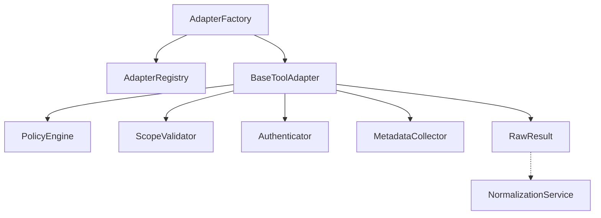
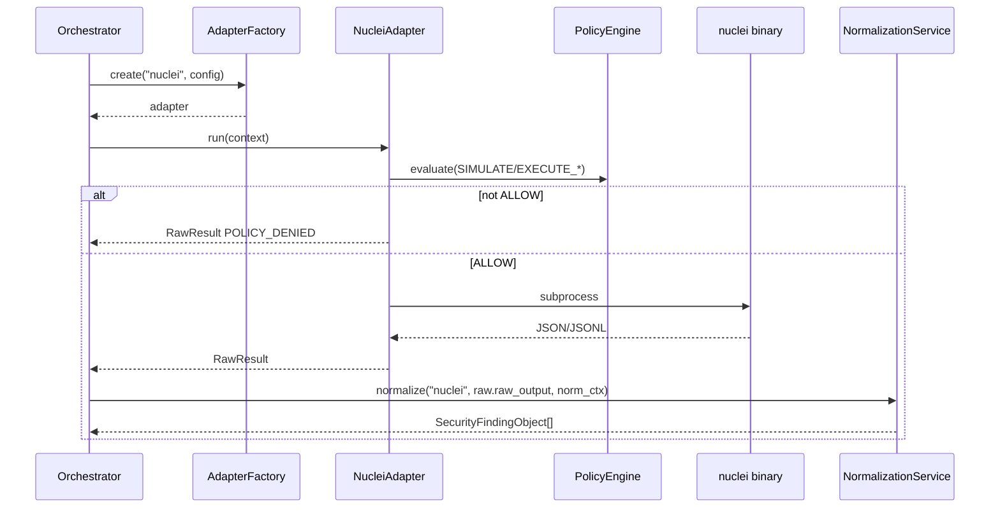
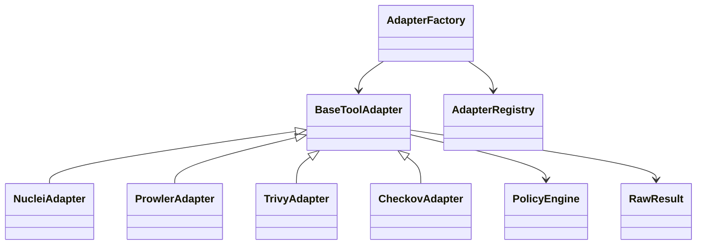

# 08 — Security Tool Adapter Framework

## Purpose

Standard interface for integrating security scanners into Xolaris.

Adapters **only** return `RawResult`. They never construct `SecurityFindingObject`.

## Responsibilities

| Owns | Does not own |
|------|----------------|
| Scanner lifecycle (auth → policy → exec → parse → RawResult) | Canonical finding creation |
| Registry / factory | Prompt / LLM flows |
| Scope validation, retries, timeouts, metadata | Long-term artifact storage implementation |

## Inputs

| Name | Type | Notes |
|------|------|-------|
| `AdapterConfig` / tool config | Pydantic | Binary, timeout, retries, credentials |
| `AdapterExecutionContext` | Pydantic | Tenant, asset, user, roles, targets, engagement window, action_class |

## Outputs

| Name | Type | Notes |
|------|------|-------|
| `RawResult` | Pydantic | stdout/stderr/raw_output/status/metadata/scope/asset |

## Dependencies



Built-in adapters: **Nuclei**, **Prowler**, **Trivy**, **Checkov**.

## Lifecycle (Template Method)

```
initialize → authenticate → validate_scope → validate_policy →
prepare → execute → collect_metadata → parse → build_raw_result → cleanup
```

Policy rule: only `PolicyVerdict.ALLOW` proceeds to execution. `DENY` / `ESCALATE` → `RawResult` with `POLICY_DENIED` (no binary run).

## Sequence diagram



## Class diagram (summary)



## Extension points

**Full plugin guide (checklist, scan ingest, MCP/agents):** [../adapters/README.md](../adapters/README.md)

1. Add `src/adapters/<tool>/{config,parser,adapter}.py`
2. `@AdapterRegistry.register("<tool>")`
3. Add matching normalizer in `normalization/adapters/`
4. Import in `bootstrap.py`
5. Optional: wire `scan_ingest` for live + simulate modes
6. No changes to downstream engine business logic required

## Non-goals

- No UI
- No direct finding emission
- Does not replace Normalization Service

## Source paths

- `backend/src/adapters/`
- **Team plugin guide:** [docs/adapters/README.md](../adapters/README.md)
- Package architecture notes: `backend/src/adapters/ARCHITECTURE.md`
- Tests: `backend/tests/test_adapters.py`

## Exceptions

`AdapterAuthenticationError`, `AdapterPolicyViolationError`, `AdapterScopeViolationError`, `AdapterExecutionError`, `AdapterTimeoutError`, `AdapterParserError`, …
