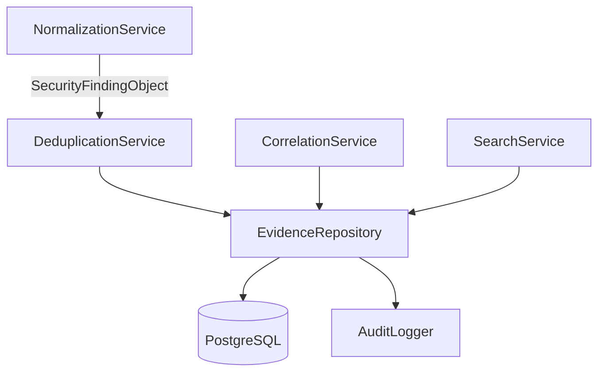
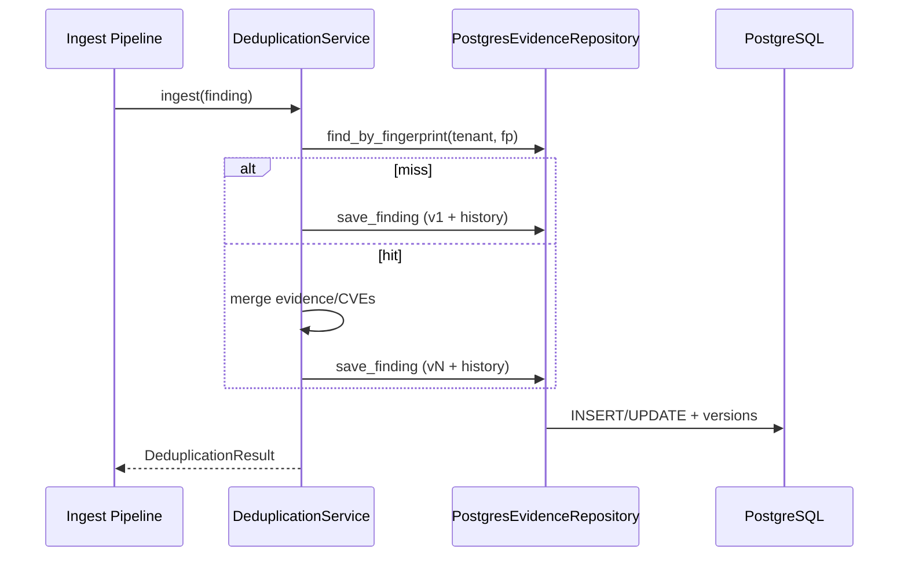
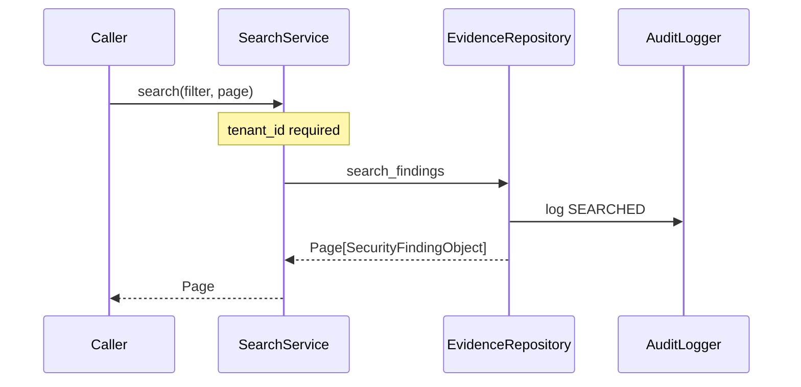

# 09 — Enterprise Evidence Repository

## Purpose

Persist and query canonical `SecurityFindingObject` / `EvidenceObject` records with versioning, audit history, deduplication, cross-scanner correlation, and strict multi-tenant isolation.

## Responsibilities

| Owns | Does not own |
|------|----------------|
| Finding/evidence storage | Scanner execution |
| Versions + history + audit log | HTTP APIs (future) |
| Dedup / correlation / search | Policy evaluation |
| Lifecycle mapping onto `FindingStatus` | Creating findings from raw JSON |

## Inputs

| Name | Type |
|------|------|
| `SecurityFindingObject` | Canonical finding |
| `EvidenceObject` | Canonical evidence |
| `FindingSearchFilter` + `PageRequest` | Query |

## Outputs

| Name | Type |
|------|------|
| Persisted findings/evidence | Canonical models |
| `FindingVersion` / `EvidenceVersion` | Snapshots |
| `FindingHistory` | Lifecycle/audit trail |
| `Page[SecurityFindingObject]` | Search results |
| `DeduplicationResult` / `CorrelationGroup` | Service outcomes |

## Dependencies

- **Imports** canonical models from `models/` (read-only usage)
- **Does not modify** adapters, normalization, policy, or AI modules

## Lifecycle mapping

| Product lifecycle | Canonical `FindingStatus` examples |
|-------------------|--------------------------------------|
| Open | `new`, `triaged`, `reopened` |
| In Progress | `in_review`, `remediating`, `verifying`, … |
| Resolved | `resolved` |
| Accepted Risk | `accepted_risk` |
| False Positive | `false_positive`, `suppressed` |

## Sequence diagram — ingest + dedup

## Sequence diagram — search

## Extension points

- Swap `EvidenceRepository` implementation (e.g. partitioned shards)
- Add read models / projections without changing canonical payloads
- Expose FastAPI routers later using `SearchService` + DI container

## Non-goals

- No REST/GraphQL in this module yet
- No changes to existing platform modules

## Source paths

- `backend/evidence_repository/`
- Package README: `backend/evidence_repository/README.md`
