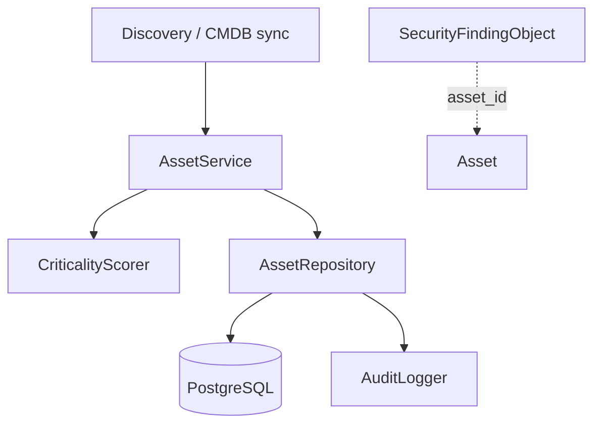
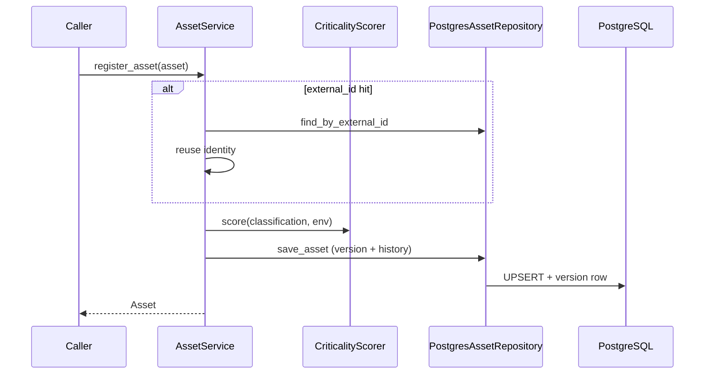

# 10 — Enterprise Asset Inventory

## Purpose

Authoritative catalog of all assets known to Xolaris. Findings, remediation, and policy workflows resolve assets through this service.

## Responsibilities

| Owns | Does not own |
|------|----------------|
| Asset / owner / BU / environment / relationship storage | Scanner execution |
| Classification, criticality scoring, exposure | Finding persistence (Evidence Repository) |
| Cloud + Kubernetes metadata | HTTP APIs (future) |
| Versioning + audit history | Creating findings |

## Inputs

| Name | Type |
|------|------|
| `Asset` and related domain models | Inventory records |
| `AssetSearchFilter` + `PageRequest` | Query |

## Outputs

| Name | Type |
|------|------|
| Persisted assets / orgs / relationships | Domain models |
| `AssetVersion` / `AssetHistory` | Snapshots + audit trail |
| `CriticalityScore` | Explainable prioritization |
| `Page[Asset]` | Search results |

## Dependencies

- **Does not modify** Evidence Repository, adapters, normalization, policy, or AI modules
- Findings reference assets by UUID only (loose coupling)

## Supported asset types

`ec2`, `azure_vm`, `gcp_vm`, `docker`, `kubernetes`, `lambda`, `s3`, `rds`, `api_gateway` (+ `other`)

## Sequence diagram — register + score

## Extension points

- Swap `AssetRepository` implementation
- Subclass `CriticalityScorer` for tenant-specific weight curves
- FastAPI routers later via `AssetInventoryContainer`

## Non-goals

- No REST/GraphQL in this module yet
- No changes to existing platform modules

## Source paths

- `backend/asset_inventory/`
- Package README: `backend/asset_inventory/README.md`
