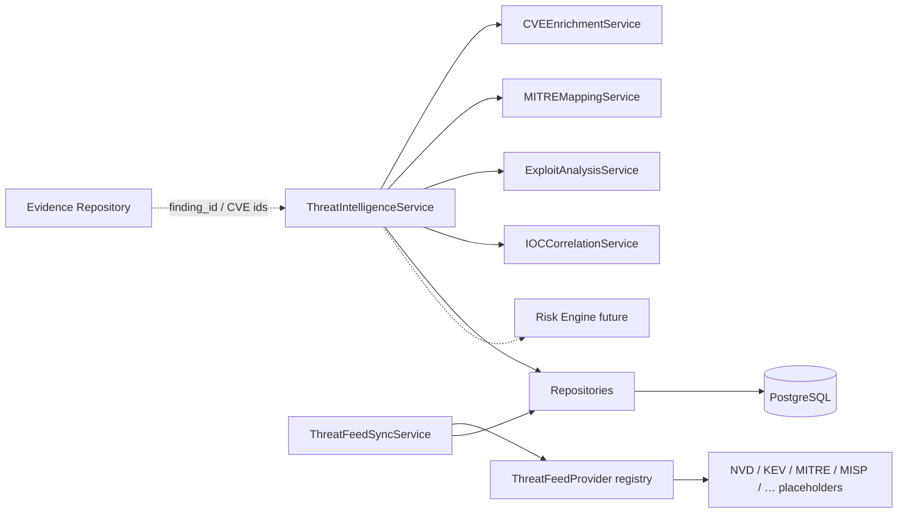
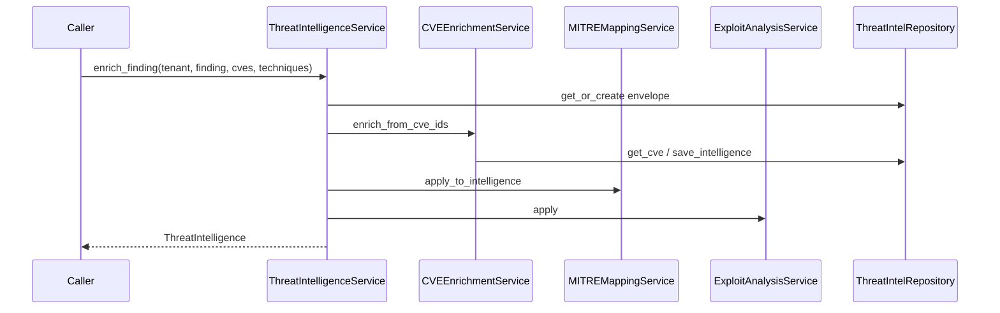

# 11 — Enterprise Threat Intelligence Service

## Purpose

Enrich `SecurityFindingObject` records (joined by `finding_id`) with external and internal threat intelligence. Acts as the intelligence layer between the Evidence Repository and the future Risk Engine.

## Responsibilities

| Owns | Does not own |
|------|----------------|
| CVE / EPSS / KEV / MITRE / IOC catalog | Finding persistence |
| Enrichment envelopes (`ThreatIntelligence`) | Live feed HTTP clients |
| Feed provider abstraction + sync orchestration | Risk scoring (future Risk Engine) |
| Versioning + audit history | REST APIs |

## Inputs

| Name | Type |
|------|------|
| Finding id + CVE / technique / IOC hints | Enrichment request |
| `CVERecord` / IOC / feed metadata | Catalog upserts |
| `FeedSyncRequest` | Provider sync |

## Outputs

| Name | Type |
|------|------|
| `ThreatIntelligence` | Enrichment envelope |
| `CVERecord`, IOCs, feed metadata | Catalog entities |
| `FeedSyncResult` | Sync outcome (often SKIPPED for placeholders) |

## Dependencies

- **Does not modify** Evidence Repository, Asset Inventory, adapters, normalization, policy, or AI modules
- Enrichment is optional and loosely coupled via `finding_id`

## Threat feed abstraction

`ThreatFeedProvider` is the extension point. Placeholder providers for NVD, CISA KEV, MITRE ATT&CK, MISP, OpenCTI, VirusTotal, AlienVault OTX, and Recorded Future return `FeedSyncStatus.SKIPPED` with no network I/O. Real connectors register into `ThreatFeedProviderRegistry` without changing services.

## Sequence diagram — enrich finding

## Extension points

- Implement `ThreatFeedProvider.sync` for a real connector
- Register via `ThreatFeedProviderRegistry`
- Swap repository implementations behind ports

## Non-goals

- No REST/GraphQL yet
- No live external API calls in this release
- No changes to existing platform modules

## Source paths

- `backend/threat_intelligence/`
- Package README: `backend/threat_intelligence/README.md`
