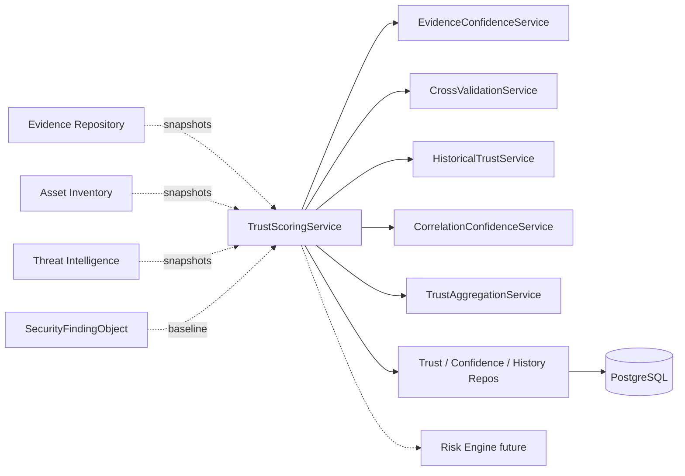
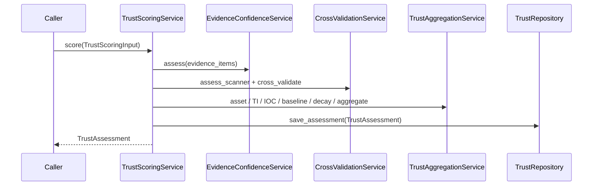

# 12 — Enterprise Trust Scoring Engine

## Purpose

Evaluate the confidence and reliability of every `SecurityFindingObject` before it reaches the Risk Engine. Produce a deterministic, explainable **Trust Score** (0–100) that reduces false positives and improves remediation decisions.

## Responsibilities

| Owns | Does not own |
|------|----------------|
| `TrustAssessment` envelopes (joined by `finding_id`) | Finding / evidence / asset / TI persistence |
| Deterministic trust scoring algorithm | Risk scoring (future Risk Engine) |
| Confidence factors, versioning, audit history | REST APIs |
| Multi-tenant trust search | AI / LLM or external API calls |

## Inputs

| Name | Type |
|------|------|
| `TrustScoringInput` | Assembled snapshots from Evidence, Asset Inventory, TI, scanner metadata, history, correlation |
| `FindingBaselineInput` | Fields derived from `SecurityFindingObject` |

## Outputs

| Name | Type |
|------|------|
| `TrustAssessment` | Envelope with score, level, factors, explanation |
| `TrustScore` | 0–100 value + `TrustLevel` |
| `RecommendationConfidence` | act / investigate / defer / discard |
| `ConfidenceFactor` | Supporting / negative explainable factors |

## Dependencies

- **Does not modify** Evidence Repository, Asset Inventory, Threat Intelligence, adapters, normalization, policy, or AI modules
- Assessment is optional and loosely coupled via `finding_id` + `tenant_id`
- Callers assemble `TrustScoringInput`; the engine never reaches into sibling ORM tables

## Trust levels

| Score | Level | Recommendation |
|------:|-------|----------------|
| ≥ 90 | Very High | Act |
| ≥ 75 | High | Act |
| ≥ 50 | Medium | Investigate |
| ≥ 25 | Low | Defer |
| < 25 | Very Low | Discard |

## Determinism

- Fixed `COMPONENT_WEIGHTS` in `domain/weights.py` (must sum to 1.0)
- Fixed time-decay half-life (90 days) and floor (0.55)
- No randomness, clocks (beyond input `evaluated_at` / `finding_age_days`), AI, or network I/O in scoring
- `algorithm_version` stamped on every assessment for reproducibility audits

## Sequence diagram — score finding

## Extension points

- Subclass component services to adjust curves without changing the facade
- Swap repository implementations behind ports
- Bump `ALGORITHM_VERSION` when weight tables change

## Non-goals

- No REST/GraphQL yet
- No AI/LLM or live external API calls
- No mutation of `SecurityFindingObject`
- No changes to existing platform modules

## Source paths

- `backend/trust_scoring/`
- Package README: `backend/trust_scoring/README.md`
