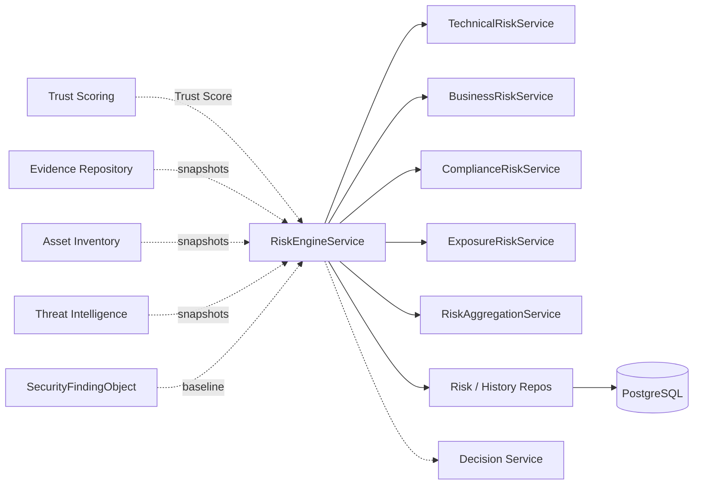
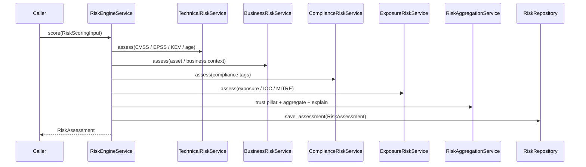

# 13 — Enterprise Risk Engine

## Purpose

Calculate the **Enterprise Risk Score** for every `SecurityFindingObject` after Trust Scoring and before the Decision Service. Produce a deterministic, explainable risk assessment (0–100) that drives priority and SLA recommendations.

## Responsibilities

| Owns | Does not own |
|------|----------------|
| `RiskAssessment` envelopes (joined by `finding_id`) | Finding / evidence / asset / TI / trust persistence |
| Deterministic enterprise risk algorithm | Trust scoring (consumes Trust Score as input) |
| Impact pillars, versioning, audit history | REST APIs |
| Multi-tenant risk search | AI / LLM or external API calls |

## Inputs

| Name | Type |
|------|------|
| `RiskScoringInput` | Assembled snapshots from Trust, TI, Asset Inventory, Evidence, CVSS/EPSS |
| `TrustRiskInput` | Trust Score from Trust Scoring Engine (required) |
| `CvssInput` / `ThreatIntelRiskInput` / `AssetRiskInput` | Optional enrichment pillars |

## Outputs

| Name | Type |
|------|------|
| `RiskAssessment` | Envelope with score, level, impacts, factors, explanation |
| `EnterpriseRiskScore` | 0–100 value + `RiskLevel` |
| `RecommendedSLA` | immediate / 24_hours / 7_days / 30_days / monitor |
| `RiskPriority` | P1–P5 |
| Impact models | `BusinessImpact`, `TechnicalImpact`, `ComplianceImpact`, `OperationalImpact` |

## Dependencies

- **Does not modify** Trust Scoring, Evidence, Asset Inventory, Threat Intelligence, adapters, normalization, policy, or AI modules
- Assessment is optional and loosely coupled via `finding_id` + `tenant_id`
- Callers assemble `RiskScoringInput`; the engine never reaches into sibling ORM tables

## Risk levels

| Score | Level | Priority | SLA |
|------:|-------|----------|-----|
| ≥ 90 | Critical | P1 | Immediate |
| ≥ 70 | High | P2 | 24 Hours |
| ≥ 40 | Medium | P3 | 7 Days |
| ≥ 20 | Low | P4 | 30 Days |
| < 20 | Informational | P5 | Monitor |

## Pillar weights

| Pillar | Weight |
|--------|-------:|
| Technical (CVSS, EPSS, KEV, exploitation, age) | 0.30 |
| Business (criticality, environment, customer-facing) | 0.25 |
| Compliance | 0.15 |
| Exposure (internet-facing, IOC, MITRE) | 0.15 |
| Trust Score | 0.15 |

Optional historical blend: 10% prior risk / 90% current.

## Determinism

- Fixed pillar and sub-weights in `domain/weights.py` (must sum to 1.0)
- Fixed SLA / priority mappings
- No randomness, AI, or network I/O in scoring
- `algorithm_version` stamped on every assessment for reproducibility audits

## Sequence diagram — score finding

## Extension points

- Subclass pillar services to adjust curves without changing the facade
- Swap repository implementations behind ports
- Bump `ALGORITHM_VERSION` when weight tables change

## Non-goals

- No REST/GraphQL yet
- No AI/LLM or live external API calls
- No mutation of `SecurityFindingObject`
- No changes to existing platform modules

## Source paths

- `backend/risk_engine/`
- Package README: `backend/risk_engine/README.md`
