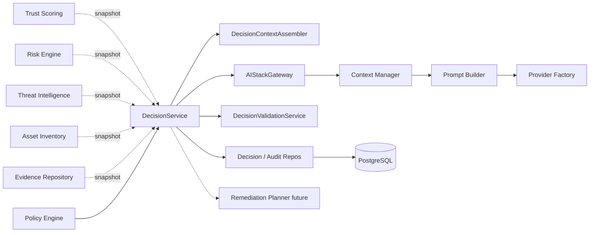
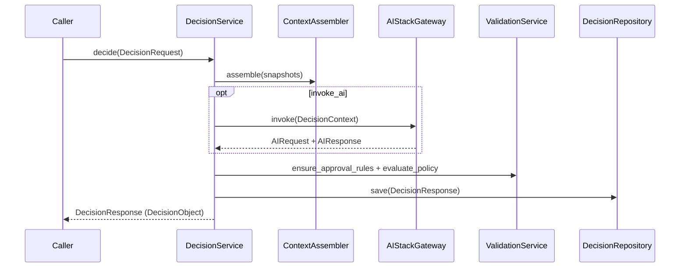

# 14 — Enterprise Decision Service

## Purpose

Orchestrate platform intelligence and (optionally) Architecture V2 AI stack to produce a canonical `DecisionObject` for each `SecurityFindingObject`. Executes **after** the Risk Engine and **before** the Remediation Planner.

> Distinct from `decision_engine` (intent routing: CHAT / TOOL / RAG / …).

## Responsibilities

| Owns | Does not own |
|------|----------------|
| `DecisionRequest` / `DecisionResponse` envelopes | Trust / Risk / TI / Evidence scoring |
| Context aggregation for decisions | Scanner execution / adapters |
| AI request/response capture + parsing | Prompt template internals |
| Policy gate coordination | Policy rule authoring |
| Decision versioning + audit | REST APIs |

## Inputs

| Name | Type |
|------|------|
| `DecisionRequest` | Assembled snapshots from Trust, Risk, TI, Asset, Evidence, Policy |
| Optional AI stack | ContextManager → PromptBuilder → ProviderFactory |

## Outputs

| Name | Type |
|------|------|
| `DecisionResponse` | Envelope with status, explanation, AI artifacts |
| `DecisionObject` | Canonical governed decision (`models.decision`) |
| `DecisionRecommendation` | remediate / ignore / escalate / investigate / monitor |
| `DecisionExplanation` | Business + technical justification, risk summary, next step |

## Dependencies

- **Does not modify** existing modules; only consumes them via imports / DI
- Callers assemble snapshots; the service never reaches into sibling ORM tables

## Sequence diagram — decide

## Decision types

| Service type | Canonical `DecisionAction` |
|--------------|----------------------------|
| remediate | remediate |
| ignore | no_action |
| escalate | escalate |
| investigate | investigate |
| monitor | monitor |

## Determinism

- Orchestration steps are deterministic given the same inputs and flags
- Deterministic advisor is fully reproducible (no AI)
- AI path is provider-dependent; inject fakes for tests
- `algorithm_version` stamped on every `DecisionResponse`

## Non-goals

- No REST/GraphQL yet
- No duplicated Trust/Risk/TI business logic
- No direct scanner interaction
- No changes to existing platform modules

## Source paths

- `backend/decision_service/`
- Package README: `backend/decision_service/README.md`
