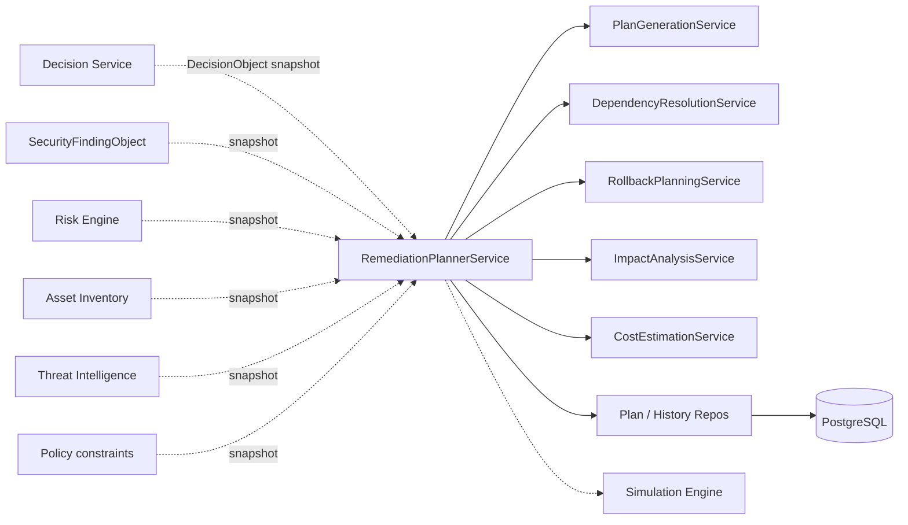
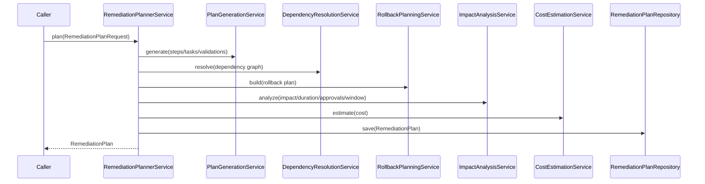

# 15 — Enterprise Remediation Planner

## Purpose

Convert an approved `DecisionObject` into a structured, deterministic **RemediationPlan** that can later be simulated, approved, executed, and verified. The planner **does not execute** infrastructure changes and makes **no AI calls**.

## Responsibilities

| Owns | Does not own |
|------|----------------|
| Plan generation (steps, tasks, validations) | Trust / Risk / Decision scoring |
| Dependency graph + rollback strategy | Simulation execution |
| Impact / duration / cost / change-window estimates | Live infrastructure changes |
| Versioned multi-tenant plan persistence | REST APIs |

## Inputs

| Name | Type |
|------|------|
| `RemediationPlanRequest` | Snapshots of Decision, Finding, Risk, Asset, TI, Policy |

## Outputs

| Name | Type |
|------|------|
| `RemediationPlan` | Planner envelope (steps, tasks, rollback, estimates) |
| Canonical exports | `to_canonical_plan()` / `to_canonical_rollback()` → `models.remediation` |

## Dependencies

- **Does not modify** existing modules
- Callers assemble snapshots; planner never reaches into sibling ORM tables

## Sequence diagram — plan

## Determinism

- Fixed execution-type selection + step templates
- No randomness, AI, or network I/O
- `algorithm_version` stamped on every plan

## Non-goals

- No REST/GraphQL
- No AI/LLM
- No infrastructure execution
- No mutation of existing modules

## Source paths

- `backend/remediation_planner/`
- Package README: `backend/remediation_planner/README.md`
