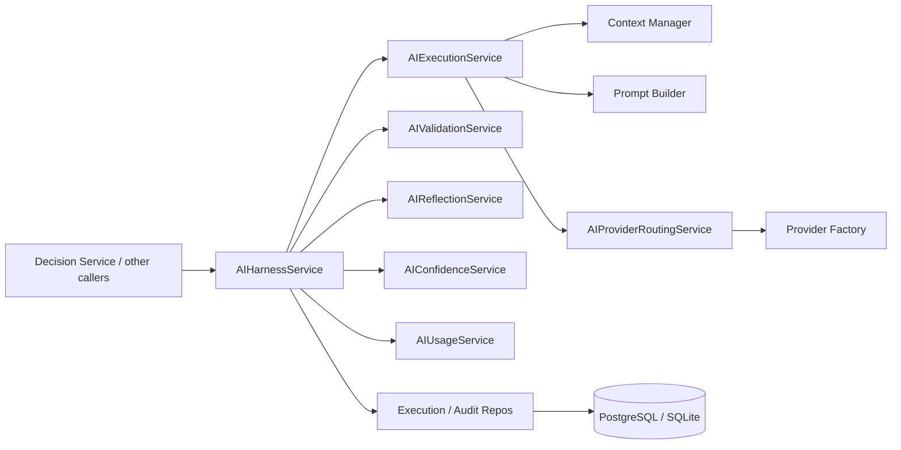
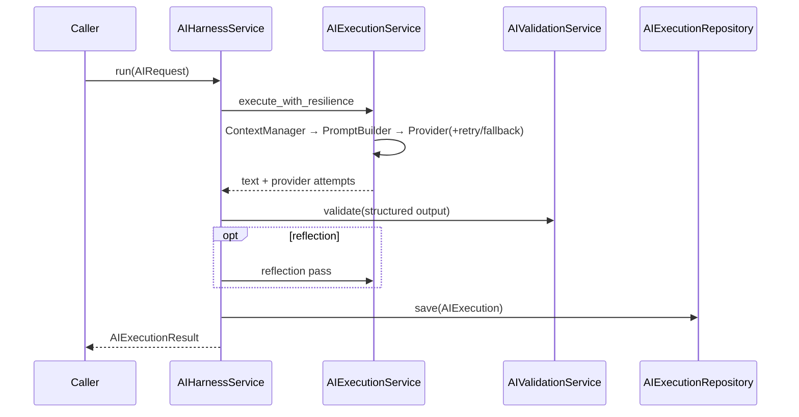

# 16 — Enterprise AI Harness

## Purpose

Centralized orchestration layer for every AI interaction in Xolaris. Wraps Context Manager, Prompt Builder, and Provider Factory with validation, resilience, observability, and governance.

Contains **no cybersecurity business logic**.

## Responsibilities

| Owns | Does not own |
|------|----------------|
| AI request/response/execution envelopes | Trust / Risk / Decision / Remediation logic |
| Provider routing, retries, fallbacks, timeouts | Prompt template content authoring |
| Structured output / JSON schema validation | Provider SDK implementations |
| Confidence / usage / cost / reflection | REST APIs |
| Multi-tenant audit of AI executions | |

## Inputs

| Name | Type |
|------|------|
| `AIRequest` | Message, optional system prompt, provider chain, schema, retry/timeout knobs |

## Outputs

| Name | Type |
|------|------|
| `AIExecutionResult` | Status, `AIResponse`, usage, confidence, validation, reflection |
| `AIExecution` | Persisted execution envelope |

## Dependencies

- Reuses existing V2 modules via import/DI only — does not modify them
- Distinct from `providers.models.AIResponse` (raw provider completion)

## Sequence diagram — run

## Non-goals

- No REST/GraphQL
- No cybersecurity domain decisions
- No changes to existing modules

## Source paths

- `backend/ai_harness/`
- Package README: `backend/ai_harness/README.md`
