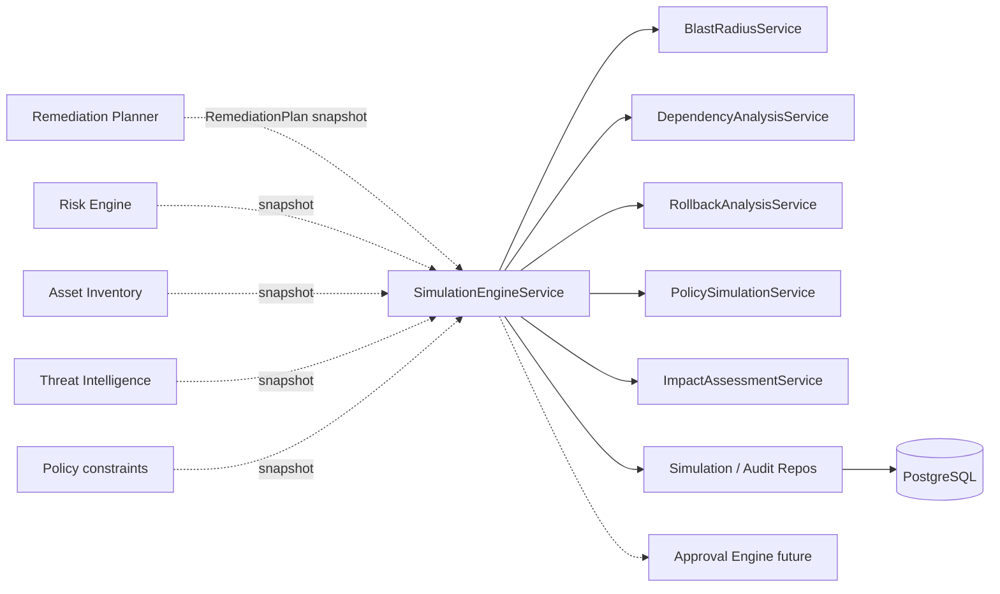
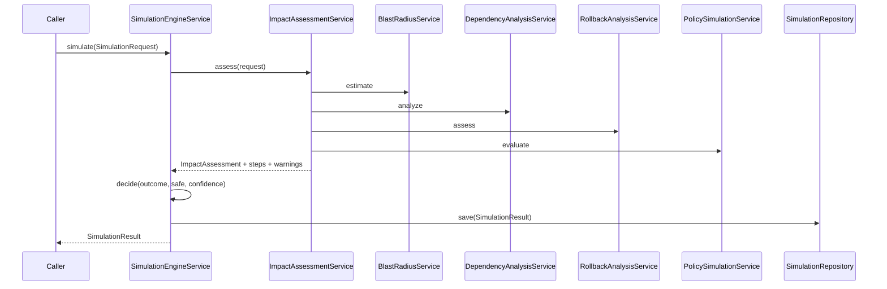

# 17 — Enterprise Simulation Engine

## Purpose

Perform a **dry-run simulation** of a `RemediationPlan` before Approval Engine / execution. Predict blast radius, downtime, rollback feasibility, policy conflicts, and risk reduction **without** changing infrastructure or calling external APIs.

## Responsibilities

| Owns | Does not own |
|------|----------------|
| Deterministic dry-run analysis | Live remediation execution |
| Blast radius / dependency / rollback / policy impact | Trust / Risk scoring |
| Versioned multi-tenant simulation persistence | REST APIs |
| Canonical `SimulationObject` export | Approval workflow |

## Inputs

| Name | Type |
|------|------|
| `SimulationRequest` | Snapshots of RemediationPlan, Risk, Asset, TI, Policy |

## Outputs

| Name | Type |
|------|------|
| `SimulationResult` | Envelope (outcome, safe_to_execute, impact, warnings, summary) |
| Canonical export | `to_canonical_simulation_object()` → `models.simulation.SimulationObject` |

## Dependencies

- **Does not modify** existing modules
- Callers assemble snapshots; engine never reaches into sibling ORM tables

## Sequence diagram — simulate

## Determinism

- Fixed formulas for blast radius, downtime buffer, risk reduction, confidence
- No randomness, AI, or network I/O
- `algorithm_version` stamped on every result

## Design goals

- No infrastructure changes
- No external API execution
- Fully auditable + versioned
- Multi-tenant isolation on all queries

## Non-goals

- No REST/GraphQL
- No live execution / adapter calls
- No mutation of existing modules

## Source paths

- `backend/simulation_engine/`
- Package README: `backend/simulation_engine/README.md`
