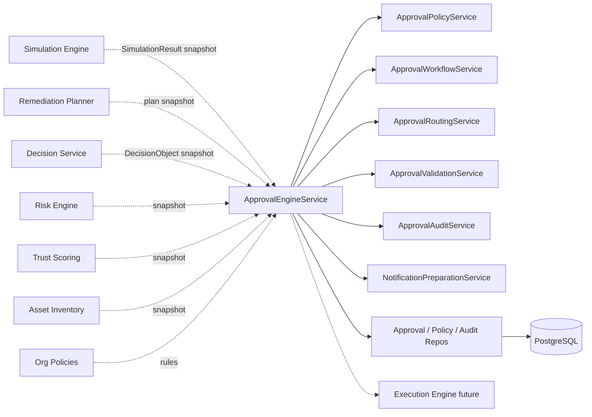
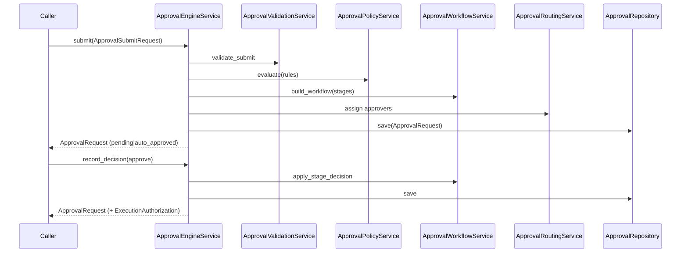

# 18 — Enterprise Approval Engine

## Purpose

Govern remediation **execution authorization** after Simulation Engine and before Execution Engine. Evaluate organizational approval policies, route to approvers, record decisions, manage multi-stage workflows, and issue `ExecutionAuthorization` — **without executing remediation**.

## Responsibilities

| Owns | Does not own |
|------|----------------|
| Approval policies / rules / workflows | Plan generation |
| Routing, delegation, escalation, expiration | Simulation / risk scoring |
| Execution authorization gate | Live infrastructure changes |
| Versioned multi-tenant persistence | REST APIs / AI calls |

## Inputs

| Name | Type |
|------|------|
| `ApprovalSubmitRequest` | Snapshots of Decision, Plan, Simulation, Risk, Trust, Asset, Org Policy |

## Outputs

| Name | Type |
|------|------|
| `ApprovalRequest` | Envelope (state, workflow, decision, timeline, notifications) |
| `ExecutionAuthorization` | Gate token for Execution Engine |
| Canonical export | `to_canonical_approval_record()` → `models.remediation.ApprovalRecord` |

## Dependencies

- **Does not modify** existing modules
- Callers assemble snapshots; engine never reaches into sibling ORM tables

## Sequence diagram — submit + decide

## Example policy logic

- Critical risk → Security Manager + Infrastructure Manager (sequential)
- Production + firewall/network change → Network Team + Security
- Low + Development + `auto_approve_enabled` → `AutoApproved`

## Design goals

- Never executes infrastructure changes
- Never calls AI
- Never modifies remediation plans or risk calculations
- Fully auditable, versioned, multi-tenant

## Non-goals

- No REST/GraphQL
- No notification delivery (preparation only)
- No mutation of existing modules

## Source paths

- `backend/approval_engine/`
- Package README: `backend/approval_engine/README.md`
