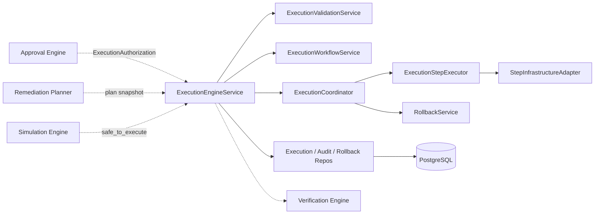
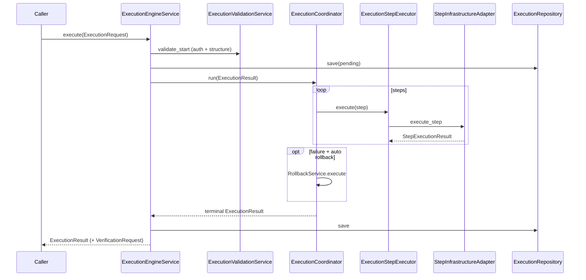

# 19 — Enterprise Execution Engine

## Purpose

Execute **approved** remediation plans after Approval Engine and before Verification Engine. Orchestrate steps, retries, timeouts, pause/resume/cancel, rollback, metrics, events, and audit — **without** evaluating policy, recalculating trust/risk, invoking AI, or modifying plans.

## Responsibilities

| Owns | Does not own |
|------|----------------|
| Execution lifecycle + step orchestration | Policy evaluation |
| Retry / timeout / pause / cancel / rollback | Trust / Risk scoring |
| Execution history, metrics, audit | AI / LLM calls |
| `VerificationRequest` handoff | Mutating RemediationPlan |
| Versioned multi-tenant persistence | REST APIs |

## Inputs

| Name | Type |
|------|------|
| `ExecutionRequest` | Snapshots: Authorization, Approval, Decision, Plan, Simulation, Risk/Trust/Asset, Org knobs |

## Outputs

| Name | Type |
|------|------|
| `ExecutionResult` | Status, step results, timeline, metrics, summary, events |
| `VerificationRequest` | Handoff for Verification Engine |
| Canonical status | `to_canonical_execution_status()` → `models.enums.ExecutionStatus` |

## Dependencies

- **Does not modify** existing modules
- Default adapter records deterministic success (no infra side effects)
- Real provider adapters plug in via DI without changing orchestration

## Sequence diagram — execute

## Design goals

- Execute only approved plans (`ExecutionAuthorization.authorized`)
- Never modify remediation plans
- Never evaluate policy / recalculate trust or risk / invoke AI
- Deterministic orchestration + auditable history
- Extensible infrastructure adapters

## Non-goals

- No REST/GraphQL
- No live cloud SDK coupling in core
- No mutation of existing modules

## Source paths

- `backend/execution_engine/`
- Package README: `backend/execution_engine/README.md`
