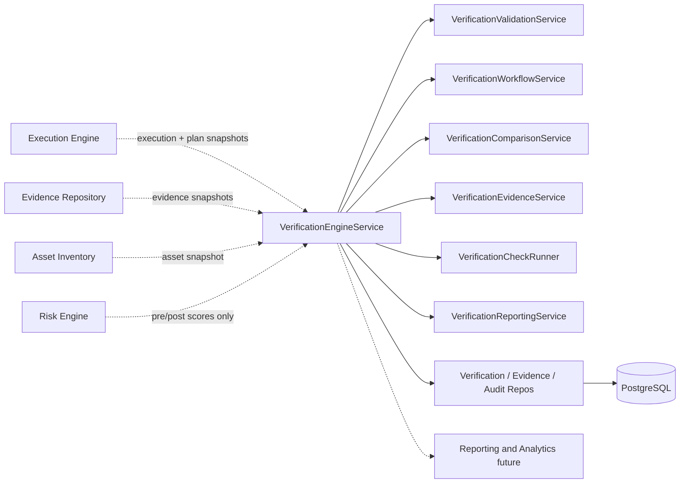
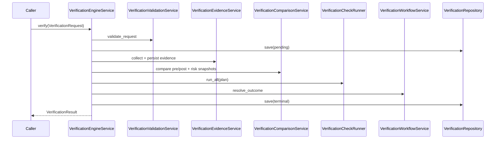

# 20 — Enterprise Verification Engine

## Purpose

Validate whether **approved remediation** was successfully executed and whether the original security finding has been resolved. Runs after Execution Engine and before Reporting & Analytics.

## Responsibilities

| Owns | Does not own |
|------|----------------|
| Post-remediation validation + check plan | Remediation execution |
| Evidence before/after comparison | Risk / trust recalculation |
| Rescan result interpretation (caller-provided) | Invoking scanners or AI |
| Closure / reopen / escalate recommendations | Approval or plan mutation |
| Versioned multi-tenant audit history | REST APIs |

## Inputs

| Name | Type |
|------|------|
| `VerificationRequest` | Snapshots: Execution, Plan, Decision, Finding, Evidence, Asset, Risk scores, Org policy, Rescan |

## Outputs

| Name | Type |
|------|------|
| `VerificationResult` | Status, checks, comparison, finding disposition, timeline, metrics, events |
| `VerificationReport` / `VerificationSummary` | Operator-facing artifacts |
| Closure recommendation | Close / Reopen / Escalate / Manual / Additional remediation |
| Canonical export | `to_canonical_verification_object()` → `models.verification.VerificationObject` |

## Dependencies

- **Does not modify** existing modules
- Risk reduction is **confirmed** from caller-provided scores, never recalculated
- Rescans are **interpreted**, never initiated against live scanners inside this package

## Sequence diagram — verify

## Verification states

Pending → Running → Verified | Failed | Reopened | Escalated | Cancelled | Completed

## Design goals

- Deterministic, auditable, multi-tenant
- Never execute remediation / never AI / never risk recalculation
- Extensible check plan via org policy knobs

## Non-goals

- No REST/GraphQL
- No live scanner or cloud SDK coupling in core
- No mutation of existing modules

## Source paths

- `backend/verification_engine/`
- Package README: `backend/verification_engine/README.md`
