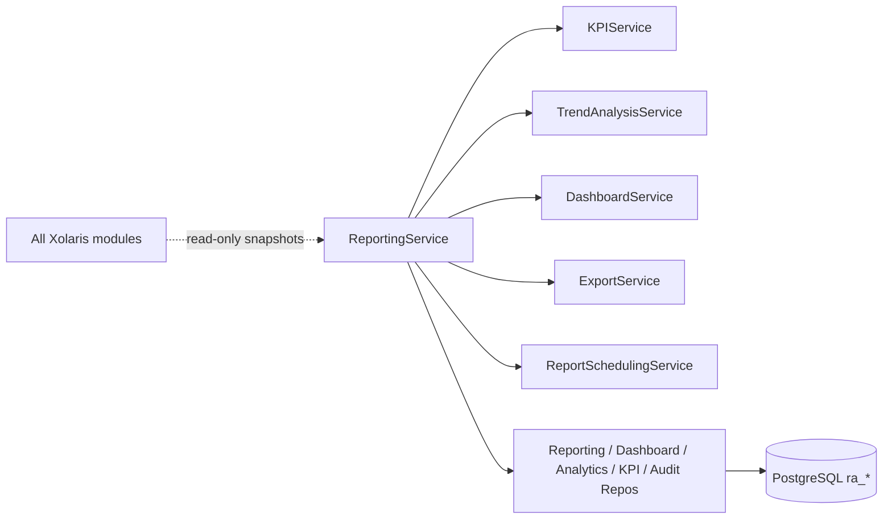
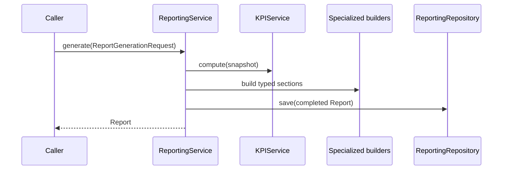

# 21 — Enterprise Reporting & Analytics Platform

## Purpose

Provide **read-only** operational visibility, executive dashboards, compliance reporting, remediation metrics, security posture analytics, AI operational metrics, audit reporting, SLA tracking, and historical trend analysis. This is the **final** module in the Xolaris control plane.

## Responsibilities

| Owns | Does not own |
|------|----------------|
| Dashboards, reports, KPIs, trends | Remediation / approval / execution |
| Export + scheduling metadata | Invoking AI |
| Reporting audit / version history | Trust / risk recalculation |
| Tenant-isolated analytics artifacts | Mutating upstream module data |
| RBAC-aware dashboard access | REST APIs |

## Inputs

| Name | Type |
|------|------|
| `PlatformAnalyticsInput` | Aggregated snapshots from Evidence, Assets, TI, Trust, Risk, Decision, AI Harness, Planner, Simulation, Approval, Execution, Verification |
| `ReportGenerationRequest` / `DashboardAccessRequest` | Report/dashboard generation |
| `ExportGenerationRequest` / `ScheduleCreateRequest` | Export & schedule |

## Outputs

| Name | Type |
|------|------|
| `Report` + `ReportResult` | Typed sections (executive, compliance, …) |
| `Dashboard` | Widgets + KPIs |
| `AnalyticsSnapshot` | Persisted KPI/trend snapshot |
| `ExportResult` | JSON / CSV / Excel-TSV / PDF-text |
| `ReportSchedule` | Cadence + next_run metadata |

## Dependencies

Callers assemble `PlatformAnalyticsInput` from upstream modules. This package **never** writes back to those modules.

## Sequence diagram — generate report

## Design goals

- Deterministic aggregation from snapshots
- Multi-tenant isolation + RBAC-aware dashboards
- Complete audit of report/dashboard/export/schedule activity
- Extensible report types and dashboard catalogs

## Non-goals

- No REST/GraphQL
- No mutation of existing modules
- No live joins into upstream databases (snapshot-in contract)
- No binary PDF/XLSX rendering libraries required in-core

## Source paths

- `backend/reporting_analytics/`
- Package README: `backend/reporting_analytics/README.md`
