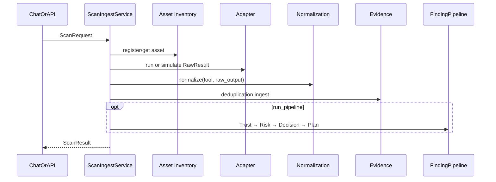

# 22 — Scan / Ingest Orchestrator

## Purpose

Connect **Chat / HTTP → Scanner adapters → Normalization → Evidence → Trust → Risk → Decision → Planner**. This is the missing glue between tool adapters and the remediation control plane.

## Responsibilities

| Owns | Does not own |
|------|----------------|
| Scan job orchestration | Scanner binary implementation (adapters) |
| Asset resolve/create for targets | Finding schema (canonical models) |
| RawResult → normalize → Evidence ingest | Approval / Execution / Verification |
| Optional Trust→Risk→Decision→Plan chain | Live notification delivery |
| Chat TOOL intent + tool execution | Replacing engine REST APIs |

## Modes

- **`simulate`** (default): deterministic sample payloads — no Nuclei/Trivy binary required
- **`live`**: `AdapterFactory.create(...).run(...)` against real tools

## Sequence

## Chat wiring

- `ScanAwareIntentRouter` → `DecisionType.TOOL` for “scan https://…”
- `ScanToolBuilder` executes orchestrator; `ToolTemplate` summarizes results for the LLM

## HTTP

`POST /api/v1/scans`

## Source

- `backend/scan_ingest/`
- Package README: `backend/scan_ingest/README.md`
