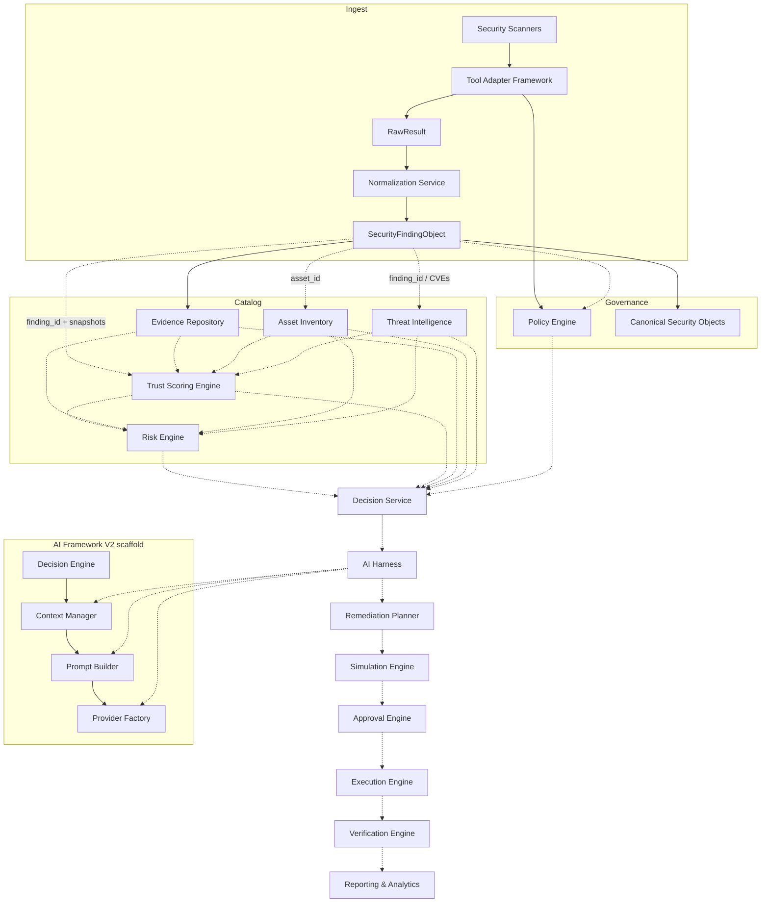

# Xolaris Architecture Documentation

This folder is the **canonical architecture record** for the Xolaris autonomous cybersecurity remediation platform.

It is maintained as modules are completed. Use it for:

- Onboarding new engineers
- Design reviews and ADRs
- Interview / walkthrough prep
- Contributor orientation before changing a subsystem

---

## How to read these docs

Each module doc follows the same template:

| Section | Contents |
|---------|----------|
| Purpose | Why the module exists |
| Responsibilities | What it owns / does not own |
| Inputs | Required inbound contracts |
| Outputs | Outbound contracts |
| Dependencies | Upstream / downstream / forbidden couplings |
| Key types | Enums, models, entrypoints |
| Sequence diagram | Runtime interaction |
| Extension points | How to grow without rewriting |
| Non-goals | Explicitly out of scope |
| Source paths | Where the code lives |

---

## Platform map

---

## Module index

| # | Module | Status | Doc |
|---|--------|--------|-----|
| 0 | Platform overview | Active | [00-platform-overview.md](./00-platform-overview.md) |
| 1 | Decision Engine | Scaffold (not wired to LLMService) | [01-decision-engine.md](./01-decision-engine.md) |
| 2 | Context Manager | Scaffold (not wired) | [02-context-manager.md](./02-context-manager.md) |
| 3 | Prompt Builder | Scaffold (not wired) | [03-prompt-builder.md](./03-prompt-builder.md) |
| 4 | Provider Factory | Scaffold + V1 LlamaProvider compat | [04-provider-factory.md](./04-provider-factory.md) |
| 5 | Canonical Security Objects | Production domain models | [05-canonical-security-objects.md](./05-canonical-security-objects.md) |
| 6 | Normalization Service | Production ingest path | [06-normalization-service.md](./06-normalization-service.md) |
| 7 | Policy Engine | Production authz path | [07-policy-engine.md](./07-policy-engine.md) |
| 8 | Security Tool Adapters | Production adapter framework | [08-security-tool-adapters.md](./08-security-tool-adapters.md) |
| 9 | Evidence Repository | Production persistence & search | [09-evidence-repository.md](./09-evidence-repository.md) |
| 10 | Asset Inventory | Production asset catalog | [10-asset-inventory.md](./10-asset-inventory.md) |
| 11 | Threat Intelligence | Production intel enrichment (feeds placeholder) | [11-threat-intelligence.md](./11-threat-intelligence.md) |
| 12 | Trust Scoring Engine | Production deterministic trust scoring | [12-trust-scoring-engine.md](./12-trust-scoring-engine.md) |
| 13 | Risk Engine | Production deterministic enterprise risk scoring | [13-risk-engine.md](./13-risk-engine.md) |
| 14 | Decision Service | Production decision orchestration (AI-assisted) | [14-decision-service.md](./14-decision-service.md) |
| 15 | Remediation Planner | Production deterministic remediation planning | [15-remediation-planner.md](./15-remediation-planner.md) |
| 16 | AI Harness | Production AI orchestration / governance | [16-ai-harness.md](./16-ai-harness.md) |
| 17 | Simulation Engine | Production dry-run remediation simulation | [17-simulation-engine.md](./17-simulation-engine.md) |
| 18 | Approval Engine | Production remediation execution authorization | [18-approval-engine.md](./18-approval-engine.md) |
| 19 | Execution Engine | Production approved remediation execution | [19-execution-engine.md](./19-execution-engine.md) |
| 20 | Verification Engine | Production post-remediation verification | [20-verification-engine.md](./20-verification-engine.md) |
| 21 | Reporting & Analytics | Production read-only enterprise reporting | [21-reporting-analytics.md](./21-reporting-analytics.md) |
| 22 | Scan / Ingest Orchestrator | Production chat+API scan→ingest→pipeline glue | [22-scan-ingest.md](./22-scan-ingest.md) |

---

## Related documents

- **Adapter plugin guide (add new tools, MCP, agents):** [adapters/README.md](../adapters/README.md)
- Legacy backend analysis (pre–Architecture V2): [`../backend_analysis.md`](../backend_analysis.md)
- Package-local READMEs still exist under some modules; **this folder is authoritative** when they diverge.

---

## Documentation rules for contributors

1. When you complete a module, add or update a doc here in the same PR.
2. Do not document aspirational behavior as if it were implemented.
3. Keep sequence diagrams accurate to the current code path.
4. Record **non-goals** so future contributors do not re-litigate scope.
5. Never put secrets, tokens, or production tenant data in diagrams or examples.
