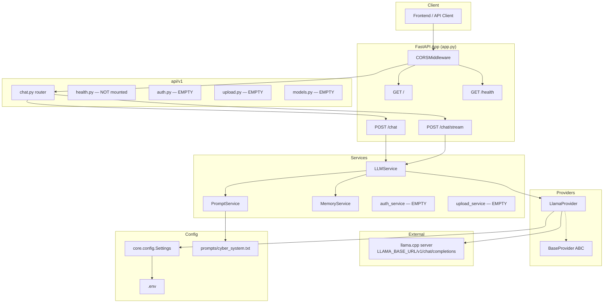
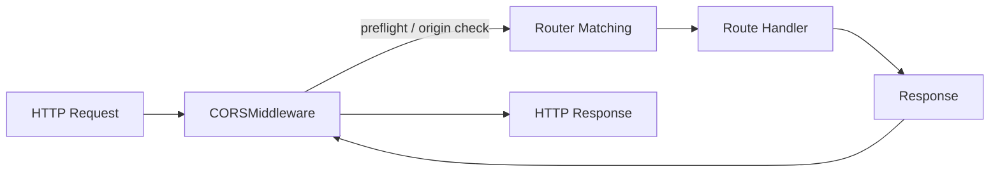
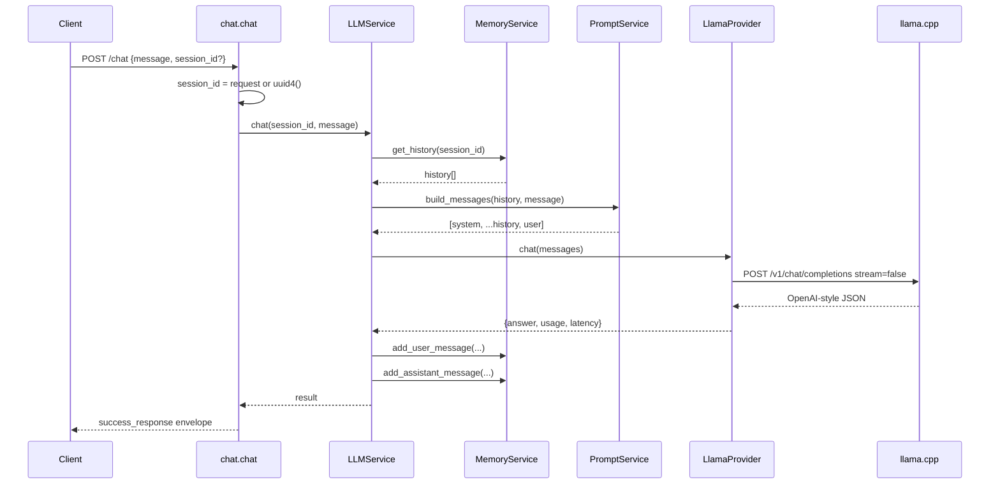
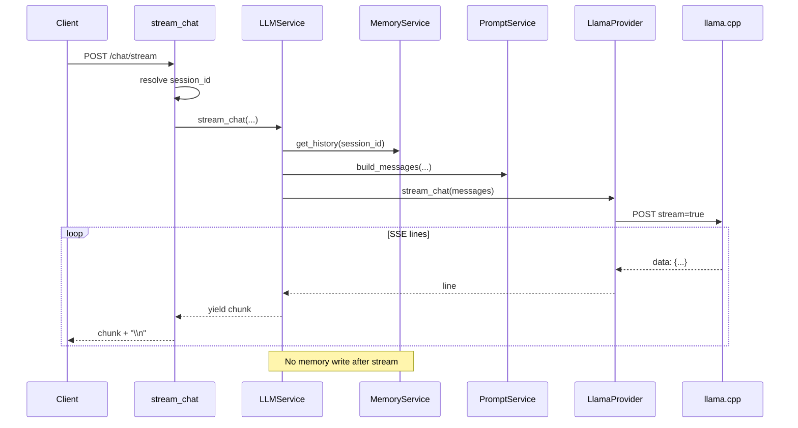
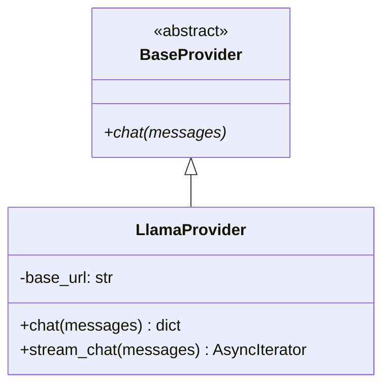
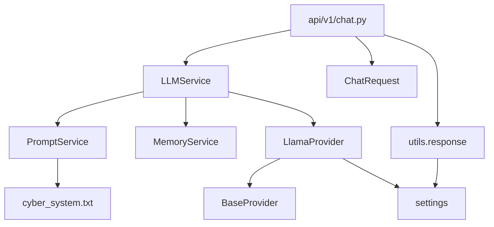
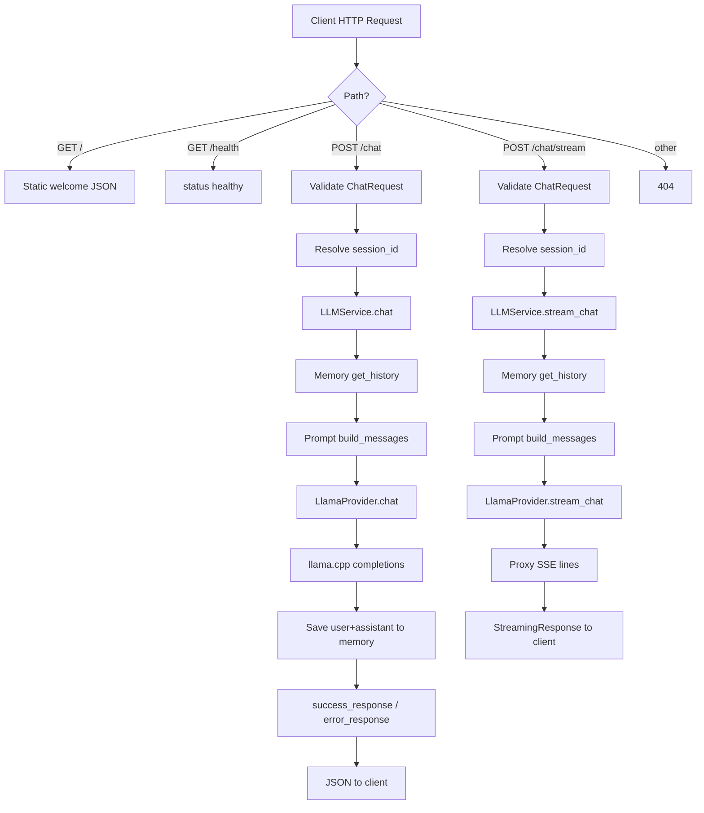
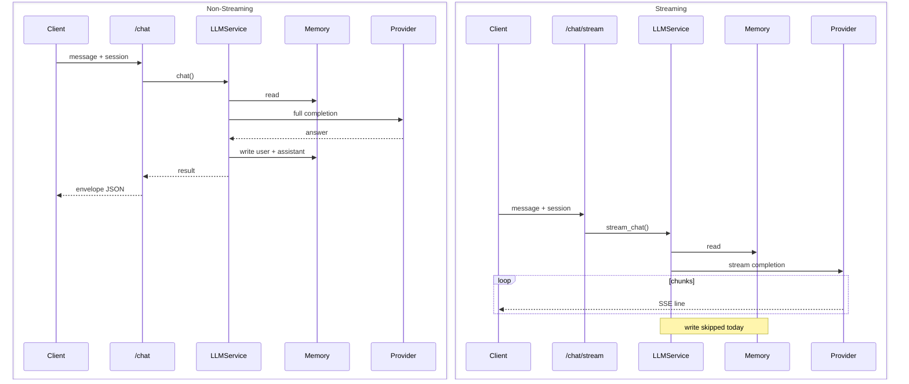

# Backend Architecture Analysis

**Project:** Cyber AI Platform (Forti AI)  
**Stack:** FastAPI · httpx · pydantic-settings · llama.cpp (OpenAI-compatible)  
**Analysis Date:** 2026-07-22  
**Scope:** Read-only analysis of the existing codebase. No redesign proposed beyond suggested improvements.

---

## 1. Executive Summary

This backend is a thin FastAPI gateway in front of a local **llama.cpp** OpenAI-compatible server (`/v1/chat/completions`). It exposes synchronous chat and streaming chat endpoints, builds prompts from a fixed system prompt file, and keeps short-term conversation history in process memory.

The intended layered layout (API → services → providers → config) is visible, but several planned modules are **empty stubs** and are **not wired** into the running app. Authentication, upload, structured logging, and dedicated middleware are scaffolding only.

---

## 2. Folder Structure

```
backend/                          # Workspace root
├── docs/
│   └── backend_analysis.md       # This document
└── backend/                      # Application package root
    ├── app.py                    # FastAPI entrypoint
    ├── .env                      # Runtime settings
    ├── requirements.txt
    ├── README.md                 # Empty
    ├── api/v1/
    │   ├── chat.py               # Active: /chat, /chat/stream
    │   ├── health.py             # Defined but NOT mounted
    │   ├── auth.py               # Empty stub
    │   ├── models.py             # Empty stub
    │   └── upload.py             # Empty stub
    ├── core/
    │   ├── config.py             # Settings via pydantic-settings
    │   ├── logger.py             # Empty stub
    │   └── security.py           # Empty stub
    ├── middleware/
    │   ├── auth.py               # Empty stub (not registered)
    │   └── logging.py            # Empty stub (not registered)
    ├── models/
    │   ├── request_models.py     # ChatRequest
    │   ├── response_models.py    # ChatResponse (unused)
    │   └── api_response.py       # APIResponse schemas (partially unused)
    ├── services/
    │   ├── llm_service.py        # Orchestrates chat/stream
    │   ├── prompt_service.py     # System prompt + message assembly
    │   ├── memory_service.py     # In-memory session history
    │   ├── auth_service.py       # Empty stub
    │   └── upload_service.py     # Empty stub
    ├── providers/
    │   ├── base_provider.py      # Abstract BaseProvider
    │   └── llama_provider.py     # httpx client to llama.cpp
    ├── prompts/
    │   └── cyber_system.txt      # Forti AI system prompt
    ├── utils/
    │   └── response.py           # success_response / error_response helpers
    └── venv/                     # Local virtualenv (not part of app logic)
```

**Note:** Several `.save` / `.save.1` editor backup files exist under `providers/`, `prompts/`, and `services/`. They are not part of the runtime path.

---

## 3. Current Architecture Diagram



### Architectural Style

| Aspect | Current State |
|--------|---------------|
| Pattern | Layered (API → Service → Provider) |
| DI style | Manual construction (module-level `LLMService()` singleton) |
| State | Process-local `defaultdict` sessions |
| Provider model | Single concrete provider (`LlamaProvider`) |
| Cross-cutting | CORS only; auth/logging middleware stubs unused |

---

## 4. FastAPI Lifecycle

### Application Creation

`app.py` creates a FastAPI instance with title `"Cyber AI Platform"` and version `"1.0.0"`.

### What Exists

1. **CORS middleware** registered at startup.
2. **Router inclusion:** only `api.v1.chat.router` is mounted (no prefix).
3. **Inline routes:** `GET /` and `GET /health` defined directly on `app`.

### What Does Not Exist

| Lifecycle Concern | Status |
|-------------------|--------|
| `@asynccontextmanager` / `lifespan` | Absent |
| Startup hooks (warm LLM, load models) | Absent |
| Shutdown hooks (flush memory, close clients) | Absent |
| Shared `httpx.AsyncClient` pooling | Absent (new client per request) |
| Dependency overrides / app.state | Absent |
| Mount of `api/v1/health.py` | Not mounted (duplicate health on `app`) |

**Implication:** The app is fully request-driven. There is no controlled warm-up or graceful teardown of resources.

---

## 5. API Endpoints

### Active (reachable)

| Method | Path | Handler | Description |
|--------|------|---------|-------------|
| `GET` | `/` | `app.root` | Static welcome JSON |
| `GET` | `/health` | `app.health` | Liveness: `{"status":"healthy"}` |
| `POST` | `/chat` | `chat.chat` | Non-streaming chat; envelope response |
| `POST` | `/chat/stream` | `chat.stream_chat` | Streaming proxy of llama.cpp SSE lines |

### Defined but unreachable / empty

| Module | Status |
|--------|--------|
| `api/v1/health.py` → `GET /health` | Router exists; **not** `include_router`'d |
| `api/v1/auth.py` | Empty file |
| `api/v1/models.py` | Empty file |
| `api/v1/upload.py` | Empty file |

### Request / Response Contracts

**`ChatRequest`** (`models/request_models.py`):

```python
message: str
session_id: Optional[str] = None
```

**Non-stream success envelope** (`utils/response.py`):

```json
{
  "success": true,
  "message": "LLM Response Generated",
  "data": {
    "session_id": "...",
    "response": "...",
    "usage": {}
  },
  "metadata": {
    "request_id": "uuid",
    "model": "RavenX",
    "latency_ms": 123.45,
    "timestamp": "ISO-8601"
  },
  "error": null
}
```

**Stream response:** `StreamingResponse` with `media_type="text/event-stream"`. Body is raw upstream lines plus `\n` — not wrapped in the success envelope.

---

## 6. Authentication Flow

### Current Reality

**There is no authentication or authorization.**

| Component | Status |
|-----------|--------|
| `core/security.py` | Empty |
| `middleware/auth.py` | Empty; not registered |
| `services/auth_service.py` | Empty |
| `api/v1/auth.py` | Empty |
| JWT / API keys / sessions | Not implemented |
| Route dependencies (`Depends`) | Not used for auth |

### Effective Access Model

```
Client → CORS check → Route handler → LLM stack
```

Any origin allowed by CORS (currently `localhost:5500` / `127.0.0.1:5500`) can call chat endpoints without credentials. Non-browser clients are unrestricted by CORS.

---

## 7. Middleware Flow

### Registered Middleware (order)

Starlette/FastAPI applies middleware in reverse registration order. Currently only:

1. **`CORSMiddleware`**
   - `allow_origins`: `http://localhost:5500`, `http://127.0.0.1:5500`
   - `allow_credentials`: `True`
   - `allow_methods`: `*`
   - `allow_headers`: `*`

### Stub Middleware (not registered)

- `middleware/logging.py` — empty
- `middleware/auth.py` — empty

### Request Path Through Middleware



No request-ID middleware, timing middleware, rate limiting, body size limits, or auth middleware exist in the live stack.

---

## 8. Request Lifecycle

### Non-Streaming Chat (`POST /chat`)



### Error Path

On any exception in `/chat`:

1. Broad `except Exception as e`
2. Returns `error_response(code="LLM_ERROR", details=str(e))`
3. HTTP status remains **200** (dict return, not `HTTPException`)

---

## 9. Chat Flow

### Orchestration (`LLMService.chat`)

1. Load session history (`MemoryService.get_history`).
2. Assemble messages (`PromptService.build_messages`): system prompt + history + new user message.
3. Call `LlamaProvider.chat`.
4. Persist user + assistant turns to memory.
5. Return `{answer, usage, latency}`.

### Session Handling

- If `session_id` is omitted, the API generates a UUID and returns it in `data.session_id`.
- Client must echo `session_id` on subsequent calls to continue the conversation.
- History is capped at **20 messages** (user + assistant turns combined).

### Gaps in Chat Flow

- Streaming path does **not** write to `MemoryService`.
- No model/temperature/max_tokens controls on the API contract.
- No cancellation / client disconnect handling beyond default ASGI behavior.

---

## 10. Upload Flow

**Status: Not implemented.**

| Artifact | State |
|----------|-------|
| `api/v1/upload.py` | Empty |
| `services/upload_service.py` | Empty |
| Multipart endpoints | None |
| File storage / virus scan / RAG ingest | None |

`python-multipart` is listed in `requirements.txt`, which suggests uploads were planned, but no routes or services exist.

---

## 11. Streaming Flow

### Endpoint: `POST /chat/stream`



### Behavior Details

- Uses `StreamingResponse` with headers:
  - `Cache-Control: no-cache`
  - `Connection: keep-alive`
  - `X-Accel-Buffering: no`
- Provider yields non-empty lines from `response.aiter_lines()` (llama.cpp SSE).
- API appends an extra `\n` per chunk.
- **No try/except** on the stream endpoint — failures surface as connection errors / ASGI exceptions.
- **History is read but not updated** after the stream completes; subsequent non-stream chats will not see streamed turns.

### Provider Streaming Client

- `httpx.AsyncClient(timeout=None)` per stream request — unbounded wait.
- No shared connection pool.

---

## 12. LLMService Flow

**File:** `services/llm_service.py`

### Responsibilities

| Method | Responsibility |
|--------|----------------|
| `__init__` | Wire `LlamaProvider`, `PromptService`, `MemoryService` |
| `chat` | History → prompt → provider → persist → return |
| `stream_chat` | History → prompt → async-yield provider chunks |

### Instantiation

```python
# api/v1/chat.py (module level)
llm = LLMService()
```

This creates a **process-wide singleton** at import time. Memory is therefore shared across all requests in that process, but not across multiple uvicorn workers.

### Coupling

- Hard-coded to `LlamaProvider` (no factory / registry).
- Direct imports of concrete services; no FastAPI `Depends`.

---

## 13. PromptService Flow

**File:** `services/prompt_service.py`

### Behavior

1. On init, resolve `prompts/cyber_system.txt` relative to package root.
2. Read entire file into `self.system_prompt` (UTF-8).
3. `build_messages(history, user_message)` returns:

```
[
  { role: "system", content: <cyber_system.txt> },
  ...history,
  { role: "user", content: <user_message> }
]
```

### System Prompt Role

Defines persona **“Forti AI”** — enterprise cybersecurity assistant with rules for severity/CVSS/CWE/ATT&CK, Markdown formatting, no invented findings, and no exposure of underlying model details.

### Characteristics

| Trait | Detail |
|-------|--------|
| Caching | Loaded once at service construction |
| Templating | None (no variables / Jinja) |
| Multi-prompt | Single fixed file |
| Hot reload | No — requires process restart |
| Failure mode | `read_text` raises if file missing (startup/import crash when LLMService is created) |

---

## 14. MemoryService Flow

**File:** `services/memory_service.py`

### Design

```python
self.sessions = defaultdict(list)
self.max_messages = 20
```

| Method | Behavior |
|--------|----------|
| `get_history` | Return list for session (or `[]`) |
| `add_user_message` | Append `{role:user}` then `_trim` |
| `add_assistant_message` | Append `{role:assistant}` then `_trim` |
| `clear` | Drop session key |
| `_trim` | Keep last 20 messages |

### Characteristics

| Trait | Detail |
|-------|--------|
| Storage | In-process RAM only |
| Persistence | None (lost on restart) |
| Multi-worker | Not shared |
| TTL / eviction | None (except per-session trim) |
| Concurrency | No locks; CPython GIL mitigates simple list appends but not multi-worker consistency |
| Used by stream | Read-only; writes only on `/chat` |

---

## 15. Provider Architecture



### BaseProvider

- Abstract `chat(messages)` only.
- **`stream_chat` is not part of the ABC** — interface incomplete relative to concrete provider.

### LlamaProvider

- Reads `settings.LLAMA_BASE_URL`.
- Non-stream: `POST {base}/v1/chat/completions` with `stream: false`, timeout **300s**.
- Stream: same path with `stream: true`, timeout **None**.
- Answer extraction prefers `message.content`, falls back to `message.reasoning_content`.
- Raises `Exception("No choices returned from llama.cpp")` if empty choices.
- Uses `response.raise_for_status()` for HTTP errors.

### Provider Extensibility (as designed vs as used)

| Capability | Status |
|------------|--------|
| ABC for swap-in providers | Partially present |
| Registry / factory | Absent |
| Multiple concurrent providers | Absent |
| Model name in payload | Not sent (relies on llama.cpp default) |

---

## 16. Configuration Loading

**File:** `core/config.py`

```python
class Settings(BaseSettings):
    APP_NAME: str = "Cyber AI Platform"
    HOST: str = "0.0.0.0"
    PORT: int = 8000
    LLAMA_BASE_URL: str = "http://127.0.0.1:8080"
    MODEL_NAME: str = "RavenX"

    class Config:
        env_file = ".env"

settings = Settings()
```

### Sources

1. Defaults in class body.
2. `.env` via pydantic-settings / python-dotenv.
3. Environment variables override `.env`.

### Current `.env` Values

| Key | Value |
|-----|-------|
| `APP_NAME` | Cyber AI Platform |
| `HOST` | 0.0.0.0 |
| `PORT` | 8000 |
| `LLAMA_BASE_URL` | http://127.0.0.1:8080 |
| `MODEL_NAME` | RavenX |

### Usage Map

| Setting | Used By |
|---------|---------|
| `LLAMA_BASE_URL` | `LlamaProvider` |
| `MODEL_NAME` | `utils.response` metadata only |
| `APP_NAME` / `HOST` / `PORT` | Defined; not referenced by `app.py` (uvicorn CLI expected) |

No YAML/TOML config layers, feature flags, or secrets manager.

---

## 17. Logging

| Component | Status |
|-----------|--------|
| `core/logger.py` | Empty |
| `middleware/logging.py` | Empty |
| Structured logging | Absent |
| Access logs | Only via uvicorn default if enabled |
| Application `logger.info/error` | Not used in services/providers |
| Request ID correlation | Generated in response metadata only; not logged |

Failures surface primarily through returned error envelopes or uncaught stream exceptions.

---

## 18. Error Handling

### Patterns Present

1. **Route-level try/except** on `/chat` → `error_response`.
2. **Provider HTTP errors** via `httpx` `raise_for_status()`.
3. **Domain check** for empty `choices`.

### Patterns Absent

| Pattern | Status |
|---------|--------|
| Global FastAPI exception handlers | Absent |
| Custom exception hierarchy | Absent |
| HTTP status code mapping (4xx/5xx) | Absent — errors often HTTP 200 |
| Validation error customization | Default FastAPI/Pydantic only |
| Stream error framing (SSE error events) | Absent |
| Retry / circuit breaker to llama.cpp | Absent |

### Response Models Drift

- `models/api_response.py` defines typed `APIResponse` / `ErrorResponse` / `Metadata`.
- Runtime helpers return plain `dict`s, not those Pydantic models.
- `models/response_models.ChatResponse` is unused.

---

## 19. Service Dependency Graph



### Dependency Table

| Component | Depends On |
|-----------|------------|
| `app.py` | `chat` router, CORS |
| `chat` router | `LLMService`, `ChatRequest`, response helpers |
| `LLMService` | `LlamaProvider`, `PromptService`, `MemoryService` |
| `LlamaProvider` | `settings`, `BaseProvider`, `httpx` |
| `PromptService` | filesystem prompt file |
| `MemoryService` | none (stdlib only) |
| `success/error_response` | `settings.MODEL_NAME` |

### Empty / Orphan Nodes

`auth_*`, `upload_*`, `middleware/*`, `core/logger`, `core/security`, `api/v1/{auth,models,upload}`, `ChatResponse`, `APIResponse` models — present on disk, unused by the live graph.

---

## 20. Component Responsibilities

| Component | Responsibility | Maturity |
|-----------|----------------|----------|
| `app.py` | App bootstrap, CORS, mount chat, root/health | Minimal but working |
| `api/v1/chat.py` | HTTP adapters for chat & stream | Working |
| `LLMService` | Orchestrate memory + prompt + provider | Working (stream incomplete vs memory) |
| `PromptService` | Load & assemble chat messages | Working |
| `MemoryService` | Short-term session history | Working (volatile) |
| `LlamaProvider` | HTTP bridge to llama.cpp | Working |
| `BaseProvider` | Provider contract | Incomplete (no stream) |
| `core/config` | Settings | Working |
| `utils/response` | Response envelope builders | Working |
| Auth / Upload / Logging / Security modules | Planned cross-cutting concerns | Stubs only |

---

## 21. Strengths

1. **Clear layered separation** — API, services, providers, config are distinct.
2. **Thin gateway** — business orchestration is small and readable.
3. **OpenAI-compatible provider** — easy to point at any compatible inference server.
4. **Consistent JSON envelope** for non-stream responses (`success`, `data`, `metadata`, `error`).
5. **Session continuity** via optional `session_id` and in-memory history.
6. **Streaming path** exists with sensible anti-buffering headers for proxies.
7. **Reasoning-model awareness** — falls back to `reasoning_content`.
8. **Typed request model** (`ChatRequest`) and settings via pydantic-settings.
9. **Persona externalized** in `cyber_system.txt` rather than hard-coded in Python.
10. **Minimal dependency surface** — FastAPI, httpx, pydantic; easy to run locally.

---

## 22. Weaknesses

1. **Scaffolding vs reality** — many empty modules create false sense of completeness.
2. **No authentication** on LLM endpoints.
3. **Streaming does not persist memory** — session inconsistency between `/chat` and `/chat/stream`.
4. **Errors return HTTP 200** with `success: false` — awkward for clients/monitoring.
5. **No application logging**.
6. **Module-level singleton** bypasses FastAPI DI and complicates testing.
7. **Provider ABC incomplete** — `stream_chat` not abstracted.
8. **New `httpx.AsyncClient` per call** — no connection reuse.
9. **Health check does not verify llama.cpp** — reports healthy even if inference is down.
10. **Dead / unused models and routers** increase maintenance noise.
11. **Editor backup files** (`.save`) committed beside sources.
12. **Empty README** — no runbook for uvicorn / llama.cpp.

---

## 23. Scalability Issues

| Issue | Impact |
|-------|--------|
| In-memory `MemoryService` | Lost on restart; not shared across workers/replicas |
| No horizontal session affinity story | Multi-worker uvicorn → fragmented sessions |
| Unbounded session map | Long-lived process can accumulate sessions forever (`clear` unused) |
| Per-request HTTP clients | Connection churn under load |
| Sync-style orchestration on async app | Fine for I/O wait, but no concurrency limits / queues |
| Single upstream llama.cpp | Throughput capped by one inference server; no load balancing |
| Stream timeout `None` | Hung upstream can pin workers indefinitely |
| No rate limiting | Easy to overwhelm local GPU/CPU inference |
| Prompt loaded in each `PromptService` instance | Currently one instance; still no centralized prompt cache service |

---

## 24. Security Concerns

| Concern | Detail |
|---------|--------|
| Unauthenticated LLM access | Anyone who can reach the port can query the model |
| `HOST=0.0.0.0` | Binds all interfaces if uvicorn uses settings — exposure risk on shared networks |
| No input size limits | Large `message` / history growth → cost & DoS on inference |
| Prompt injection | System prompt is static; no input sanitization or policy layer |
| Error detail leakage | `details=str(e)` may expose internal URLs/stack context to clients |
| CORS credentials + wildcard methods/headers | Acceptable for local demo; risky if origins widen carelessly |
| No secrets beyond local URL | Low secret surface today, but no security module ready for production keys |
| Offensive-security persona | Forti AI covers pentest topics — needs usage policy / abuse controls in real deployments |
| Upload stubs with multipart dependency | Future upload path needs auth, type validation, size limits (not present) |

---

## 25. Technical Debt

1. Empty stubs: `auth`, `upload`, `models` API, `logger`, `security`, middleware, services.
2. Duplicate health endpoints (`app.py` vs unmounted `api/v1/health.py`).
3. Pydantic response models unused; helpers return raw dicts.
4. `BaseProvider` vs `LlamaProvider` interface mismatch on streaming.
5. Backup files (`.save`, `.save.1`) polluting the tree.
6. No tests directory / no pytest harness observed.
7. No lifespan, no shared HTTP client, no DI pattern.
8. `ChatResponse` model unused.
9. Stream path feature-incomplete relative to non-stream path (memory).
10. Configuration fields `HOST`/`PORT` unused by application code.
11. README empty despite being the natural ops entrypoint.

---

## 26. Suggested Improvements

> Analysis-only recommendations. These are not an alternate architecture redesign; they extend the existing layered design.

### Short-term (stabilize current behavior)

1. Persist streamed conversations into `MemoryService` (buffer full assistant text, then `add_*`).
2. Map failures to proper HTTP status codes (`502` upstream, `500` unexpected) or document the envelope-as-200 contract explicitly.
3. Add minimal structured logging (`request_id`, latency, session_id, status).
4. Share a single `httpx.AsyncClient` via app lifespan.
5. Extend health to probe `LLAMA_BASE_URL` (readiness vs liveness).
6. Remove or quarantine empty stubs and `.save` files to reduce confusion.
7. Align `BaseProvider` with both `chat` and `stream_chat`.

### Medium-term (production readiness)

8. Introduce auth (API key or JWT) before exposing beyond localhost.
9. Move session memory to Redis (or similar) for multi-worker safety + TTL eviction.
10. Add rate limiting and max message length validation.
11. Use FastAPI `Depends` for `LLMService` to enable testing overrides.
12. Global exception handlers; stop leaking raw exception strings.
13. Wire upload only when requirements are clear (RAG vs attachment context).

### Longer-term (scale)

14. Provider registry if multiple backends are needed.
15. Queue / backpressure in front of GPU inference.
16. Observability: metrics (tokens, latency histograms), tracing.
17. Config separation: local `.env` vs deployment secrets.

---

## 27. Request Flow Diagram (End-to-End)



---

## 28. Sequence Diagram (Streaming vs Non-Streaming Contrast)



---

## 29. Service Dependency Graph (Compact)

```
app.py
 └── api.v1.chat
      ├── models.request_models.ChatRequest
      ├── utils.response.{success,error}_response
      │    └── core.config.settings
      └── services.llm_service.LLMService
           ├── services.prompt_service.PromptService
           │    └── prompts/cyber_system.txt
           ├── services.memory_service.MemoryService
           └── providers.llama_provider.LlamaProvider
                ├── providers.base_provider.BaseProvider
                └── core.config.settings
```

---

## 30. Conclusion

The backend is a **functional MVP chat gateway**: FastAPI routes → orchestration service → llama.cpp provider, with in-memory sessions and a fixed cybersecurity system prompt. The folder layout anticipates auth, upload, logging, and middleware, but those pieces are **not implemented or mounted**.

Primary risks for growth are **unauthenticated access**, **volatile/non-shared memory**, **stream/memory inconsistency**, and **missing operational concerns** (logging, readiness, connection pooling, HTTP error semantics). The existing layered structure is a sound base for incremental hardening without requiring a greenfield rewrite.
